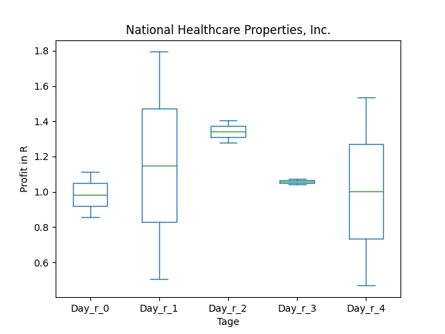
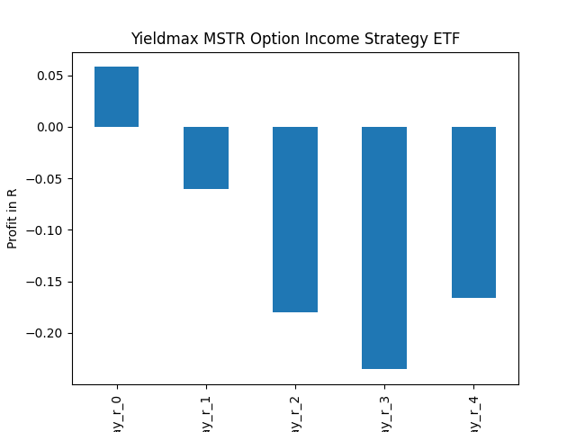

# dividend-shorter

bet on falling prices on payday **2025-07-03**.

## Signale

| Ticker   |   Divid Rate |   Close |           Volume |   last_close_volume |   Divid % | 5_Days_pos   | above_SMA_50   |
|:---------|-------------:|--------:|-----------------:|--------------------:|----------:|:-------------|:---------------|
| XYZY     |         0.44 |   10.25 | 384700           |             3943175 |      4.29 | True         | True           |
| WNTR     |         1.86 |   35.53 | 258600           |             9188058 |      5.22 | False        | False          |
| TWO      |         0.39 |   11.02 |      3.5454e+06  |            39070308 |      3.54 | True         | False          |
| SMCY     |         1.61 |   21.15 |      3.3622e+06  |            71110530 |      7.61 | True         | True           |
| NOAH     |         1.16 |   12.59 | 355100           |             4470709 |      9.19 | True         | True           |
| NHPBP    |         0.45 |   15.1  |  20100           |              303510 |      2.95 | True         | True           |
| NHPAP    |         0.46 |   15.64 |  30200           |              472328 |      2.95 | True         | True           |
| MSTY     |         1.24 |   22.1  |      1.42255e+07 |           314383550 |      5.6  | True         | True           |
| IDCBY    |         0.46 |   16.1  |  23800           |              383180 |      2.85 | False        | True           |
| HNHPF    |         0.39 |   11.6  | 175000           |             2030000 |      3.34 | True         | True           |
| DSWL     |         0.1  |    2.91 |  71700           |              208647 |      3.44 | True         | True           |
| DISO     |         0.42 |   14.8  |  42700           |              631960 |      2.81 | True         | True           |
| CIHKY    |         1.39 |   35.75 |  21300           |              761475 |      3.89 | True         | True           |
| CHT      |         1.67 |   46.95 | 153400           |             7202130 |      3.56 | True         | True           |
| AMZY     |         0.59 |   16.35 | 571800           |             9348930 |      3.61 | True         | True           |
| AIYY     |         0.16 |    4.44 |      1.7543e+06  |             7789092 |      3.6  | True         | True           |

## XYZY

### Erwartung in R
|      |   Day_r_0 |   Day_r_1 |   Day_r_2 |   Day_r_3 |   Day_r_4 |   Treffer |
|:-----|----------:|----------:|----------:|----------:|----------:|----------:|
| ohne |      -0.1 |      -0.1 |      -0.3 |      -0.4 |      -0.2 |         3 |
| mit  |      -0.1 |      -0.1 |      -0.6 |      -0.6 |      -0.5 |         2 |

### Ohne Filter

### Mit Filter

## WNTR

### Erwartung in R
|      |   Day_r_0 |   Day_r_1 |   Day_r_2 |   Day_r_3 |   Day_r_4 |   Treffer |
|:-----|----------:|----------:|----------:|----------:|----------:|----------:|
| ohne |      -0.1 |      -0.1 |         0 |       0.1 |         0 |         2 |
| mit  |      -0.1 |      -0.1 |         0 |       0.1 |         0 |         2 |

### Ohne Filter

### Mit Filter

## TWO

### Erwartung in R
|      |   Day_r_0 |   Day_r_1 |   Day_r_2 |   Day_r_3 |   Day_r_4 |   Treffer |
|:-----|----------:|----------:|----------:|----------:|----------:|----------:|
| ohne |       0   |       0.1 |       0   |       0.1 |       0   |        63 |
| mit  |       0.2 |       0.1 |       0.2 |       0.4 |       0.5 |        10 |

### Ohne Filter

### Mit Filter

## SMCY

### Erwartung in R
|      |   Day_r_0 |   Day_r_1 |   Day_r_2 |   Day_r_3 |   Day_r_4 |   Treffer |
|:-----|----------:|----------:|----------:|----------:|----------:|----------:|
| ohne |       0.2 |       0.2 |      -0.1 |      -0.4 |      -0.2 |         9 |
| mit  |       0.2 |       0.2 |      -0.1 |      -0.4 |      -0.2 |         9 |

### Ohne Filter

### Mit Filter

## NOAH

### Erwartung in R
|      |   Day_r_0 |   Day_r_1 |   Day_r_2 |   Day_r_3 |   Day_r_4 |   Treffer |
|:-----|----------:|----------:|----------:|----------:|----------:|----------:|
| ohne |       0.5 |       0.3 |       0.4 |       0.6 |       0.5 |         5 |
| mit  |       0.5 |       0.3 |       0.4 |       0.6 |       0.5 |         2 |

### Ohne Filter

### Mit Filter

## NHPBP

### Erwartung in R
|      |   Day_r_0 |   Day_r_1 |   Day_r_2 |   Day_r_3 |   Day_r_4 |   Treffer |
|:-----|----------:|----------:|----------:|----------:|----------:|----------:|
| ohne |         1 |       2.1 |       2.1 |         2 |       3.2 |         2 |
| mit  |       nan |     nan   |     nan   |       nan |     nan   |         0 |

### Ohne Filter

### Mit Filter

## NHPAP

### Erwartung in R
|      |   Day_r_0 |   Day_r_1 |   Day_r_2 |   Day_r_3 |   Day_r_4 |   Treffer |
|:-----|----------:|----------:|----------:|----------:|----------:|----------:|
| ohne |         1 |       1.2 |       1.3 |       1.1 |         1 |         2 |
| mit  |       nan |     nan   |     nan   |     nan   |       nan |         0 |

### Ohne Filter

### Mit Filter

## MSTY

### Erwartung in R
|      |   Day_r_0 |   Day_r_1 |   Day_r_2 |   Day_r_3 |   Day_r_4 |   Treffer |
|:-----|----------:|----------:|----------:|----------:|----------:|----------:|
| ohne |       0.1 |      -0.1 |      -0.2 |      -0.2 |      -0.2 |        15 |
| mit  |       0.1 |      -0.1 |      -0.2 |      -0.2 |      -0.2 |        15 |

### Ohne Filter

### Mit Filter

## IDCBY

### Erwartung in R
|      |   Day_r_0 |   Day_r_1 |   Day_r_2 |   Day_r_3 |   Day_r_4 |   Treffer |
|:-----|----------:|----------:|----------:|----------:|----------:|----------:|
| ohne |       0.7 |       0.8 |       0.8 |       0.7 |       0.9 |        14 |
| mit  |       0.6 |       0.5 |       0.8 |       0.6 |       0.6 |         7 |

### Ohne Filter

### Mit Filter

## HNHPF

### Erwartung in R
|      |   Day_r_0 |   Day_r_1 |   Day_r_2 |   Day_r_3 |   Day_r_4 |   Treffer |
|:-----|----------:|----------:|----------:|----------:|----------:|----------:|
| ohne |       0   |      -0   |      -0.1 |      -0.4 |      -0.3 |        16 |
| mit  |       0.3 |       0.8 |       0.8 |       1.1 |       1   |         1 |

### Ohne Filter

### Mit Filter

## DSWL

### Erwartung in R
|      |   Day_r_0 |   Day_r_1 |   Day_r_2 |   Day_r_3 |   Day_r_4 |   Treffer |
|:-----|----------:|----------:|----------:|----------:|----------:|----------:|
| ohne |       0.1 |      -0.1 |         0 |       0.1 |       0.1 |        63 |
| mit  |     nan   |     nan   |       nan |     nan   |     nan   |         0 |

### Ohne Filter

### Mit Filter

## DISO

### Erwartung in R
|      |   Day_r_0 |   Day_r_1 |   Day_r_2 |   Day_r_3 |   Day_r_4 |   Treffer |
|:-----|----------:|----------:|----------:|----------:|----------:|----------:|
| ohne |       0.3 |       0.1 |       0.1 |       0   |      -0.3 |        21 |
| mit  |      -0.3 |       3   |       2.9 |       2.7 |       2.9 |         1 |

### Ohne Filter

### Mit Filter

## CIHKY

### Erwartung in R
|      |   Day_r_0 |   Day_r_1 |   Day_r_2 |   Day_r_3 |   Day_r_4 |   Treffer |
|:-----|----------:|----------:|----------:|----------:|----------:|----------:|
| ohne |         0 |      -0.2 |       0.1 |       0.3 |       0.6 |        13 |
| mit  |         0 |       0.3 |       0.4 |       0.6 |       0.8 |         3 |

### Ohne Filter

### Mit Filter

## CHT

### Erwartung in R
|      |   Day_r_0 |   Day_r_1 |   Day_r_2 |   Day_r_3 |   Day_r_4 |   Treffer |
|:-----|----------:|----------:|----------:|----------:|----------:|----------:|
| ohne |       0.1 |       0.2 |       0.2 |       0.3 |       0.2 |        25 |
| mit  |       0.1 |       0.2 |       0.2 |       0.2 |       0.2 |        20 |

### Ohne Filter

### Mit Filter

## AMZY

### Erwartung in R
|      |   Day_r_0 |   Day_r_1 |   Day_r_2 |   Day_r_3 |   Day_r_4 |   Treffer |
|:-----|----------:|----------:|----------:|----------:|----------:|----------:|
| ohne |         0 |      -0.1 |      -0.2 |      -0.3 |      -0.3 |        22 |
| mit  |         0 |      -0.1 |      -0.1 |      -0.2 |      -0.2 |        13 |

### Ohne Filter

### Mit Filter

## AIYY

### Erwartung in R
|      |   Day_r_0 |   Day_r_1 |   Day_r_2 |   Day_r_3 |   Day_r_4 |   Treffer |
|:-----|----------:|----------:|----------:|----------:|----------:|----------:|
| ohne |       0.1 |        -0 |      -0.3 |      -0.2 |      -0.2 |        18 |
| mit  |       0.1 |         0 |      -0.1 |      -0.2 |      -0.2 |        13 |

### Ohne Filter

### Mit Filter

