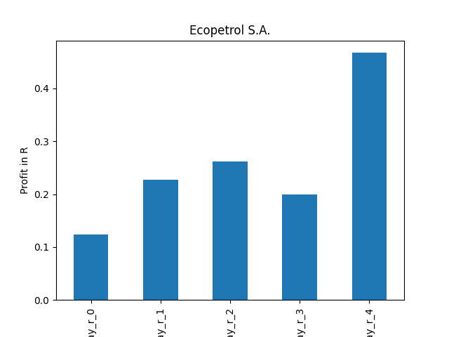

# dividend-shorter

bet on falling prices on payday **2025-04-03**.

## Signale

| Ticker   |   Divid Rate |   Close |         Volume |   last_close_volume |   Divid % | 5_Days_pos   | above_SMA_50   |
|:---------|-------------:|--------:|---------------:|--------------------:|----------:|:-------------|:---------------|
| SKFRY    |         0.7  |   20.48 | 18100          |              370688 |      3.4  | False        | False          |
| SGSOY    |         0.36 |   10    | 58400          |              584000 |      3.63 | True         | False          |
| PPC      |         6.3  |   55.3  |     1.6079e+06 |            88916870 |     11.39 | True         | True           |
| EC       |         0.52 |   10.63 |     2.4402e+06 |            25939326 |      4.89 | True         | True           |
| BDN      |         0.15 |    4.49 |     1.8935e+06 |             8501815 |      3.34 | False        | False          |

## SKFRY

### Erwartung in R
|      |   Day_r_0 |   Day_r_1 |   Day_r_2 |   Day_r_3 |   Day_r_4 |   Treffer |
|:-----|----------:|----------:|----------:|----------:|----------:|----------:|
| ohne |       0   |      -0.2 |      -0.3 |      -0.3 |      -0.2 |        16 |
| mit  |       0.2 |       0.2 |      -0.2 |      -0.1 |       0.2 |         2 |

### Ohne Filter

### Mit Filter

## SGSOY

### Erwartung in R
|      |   Day_r_0 |   Day_r_1 |   Day_r_2 |   Day_r_3 |   Day_r_4 |   Treffer |
|:-----|----------:|----------:|----------:|----------:|----------:|----------:|
| ohne |      -0   |       0   |      -0.1 |      -0.1 |       0.2 |        17 |
| mit  |      -0.3 |       0.1 |      -0   |      -0   |       0.2 |         3 |

### Ohne Filter

### Mit Filter

## PPC

### Erwartung in R
|      |   Day_r_0 |   Day_r_1 |   Day_r_2 |   Day_r_3 |   Day_r_4 |   Treffer |
|:-----|----------:|----------:|----------:|----------:|----------:|----------:|
| ohne |       0.1 |      -0.1 |       0.1 |       0.1 |       0.1 |         2 |
| mit  |       0.1 |      -0.1 |       0.1 |       0.1 |       0.1 |         2 |

### Ohne Filter

### Mit Filter

## EC

### Erwartung in R
|      |   Day_r_0 |   Day_r_1 |   Day_r_2 |   Day_r_3 |   Day_r_4 |   Treffer |
|:-----|----------:|----------:|----------:|----------:|----------:|----------:|
| ohne |       0.1 |       0.2 |       0.2 |       0.2 |       0.3 |        37 |
| mit  |       0.1 |       0.1 |       0.2 |       0.2 |       0.4 |        14 |

### Ohne Filter

### Mit Filter

## BDN

### Erwartung in R
|      |   Day_r_0 |   Day_r_1 |   Day_r_2 |   Day_r_3 |   Day_r_4 |   Treffer |
|:-----|----------:|----------:|----------:|----------:|----------:|----------:|
| ohne |       0.1 |       0.2 |       0   |      -0.1 |      -0.2 |        81 |
| mit  |       0.1 |       0.5 |       0.1 |       0.4 |       0.2 |        10 |

### Ohne Filter

### Mit Filter

