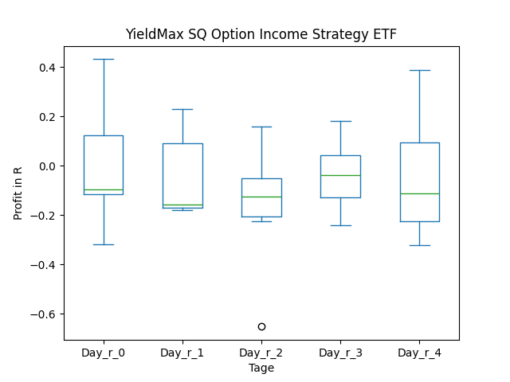
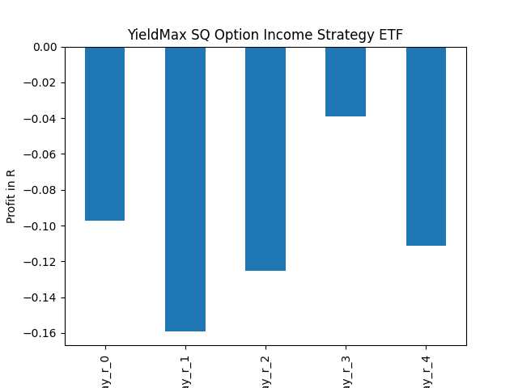
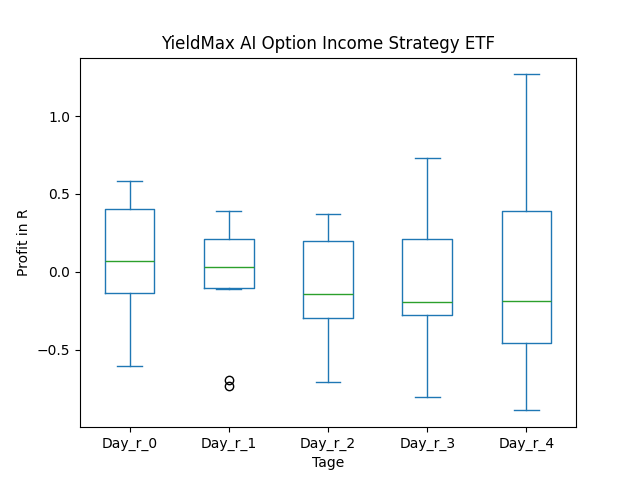

# dividend-shorter

bet on falling prices on payday **2025-03-13**.

## Signale

| Ticker   |   Divid Rate |   Close |          Volume |   last_close_volume |   Divid % | 5_Days_pos   | above_SMA_50   |
|:---------|-------------:|--------:|----------------:|--------------------:|----------:|:-------------|:---------------|
| SQY      |         0.5  |   11.48 |  66300          |              761124 |      4.37 | False        | False          |
| SMCY     |         1.97 |   26.08 | 780300          |            20350224 |      7.57 | True         | True           |
| MSTY     |         1.38 |   20.22 |      6.6348e+06 |           134155656 |      6.81 | False        | False          |
| CBL      |         0.8  |   28.7  | 210900          |             6052830 |      2.79 | False        | False          |
| AMBP     |         0.1  |    2.77 |      2.2309e+06 |             6179593 |      3.61 | False        | False          |
| AIYY     |         0.32 |    5.18 |      1.0282e+06 |             5326076 |      6.22 | True         | False          |
| AFBI     |         1.5  |   19.89 |  82200          |             1634958 |      7.54 | True         | True           |

## SQY

### Erwartung in R
|      |   Day_r_0 |   Day_r_1 |   Day_r_2 |   Day_r_3 |   Day_r_4 |   Treffer |
|:-----|----------:|----------:|----------:|----------:|----------:|----------:|
| ohne |      -0.1 |      -0.2 |      -0.1 |      -0.2 |      -0.2 |        16 |
| mit  |      -0.1 |      -0.2 |      -0.1 |      -0   |      -0.1 |         7 |

### Ohne Filter

### Mit Filter

## SMCY

### Erwartung in R
|      |   Day_r_0 |   Day_r_1 |   Day_r_2 |   Day_r_3 |   Day_r_4 |   Treffer |
|:-----|----------:|----------:|----------:|----------:|----------:|----------:|
| ohne |         0 |      -0.2 |      -0.3 |      -0.6 |      -0.5 |         5 |
| mit  |         0 |      -0.2 |      -0.3 |      -0.6 |      -0.5 |         5 |

### Ohne Filter

### Mit Filter

## MSTY

### Erwartung in R
|      |   Day_r_0 |   Day_r_1 |   Day_r_2 |   Day_r_3 |   Day_r_4 |   Treffer |
|:-----|----------:|----------:|----------:|----------:|----------:|----------:|
| ohne |       0.1 |      -0.1 |       0.1 |       0.1 |       0.1 |        11 |
| mit  |       0.1 |      -0.1 |       0.1 |       0.1 |       0.1 |        11 |

### Ohne Filter

### Mit Filter

## CBL

### Erwartung in R
|      |   Day_r_0 |   Day_r_1 |   Day_r_2 |   Day_r_3 |   Day_r_4 |   Treffer |
|:-----|----------:|----------:|----------:|----------:|----------:|----------:|
| ohne |       0.1 |       0.1 |       0.4 |       0.2 |      -0.3 |        12 |
| mit  |       0.2 |       0.4 |       0.7 |       0.8 |       0.9 |         1 |

### Ohne Filter

### Mit Filter

## AMBP

### Erwartung in R
|      |   Day_r_0 |   Day_r_1 |   Day_r_2 |   Day_r_3 |   Day_r_4 |   Treffer |
|:-----|----------:|----------:|----------:|----------:|----------:|----------:|
| ohne |       0.1 |       0   |       0.4 |       0.4 |       0.3 |        11 |
| mit  |       0.3 |      -0.4 |       0   |      -0.2 |       0.1 |         4 |

### Ohne Filter

### Mit Filter

## AIYY

### Erwartung in R
|      |   Day_r_0 |   Day_r_1 |   Day_r_2 |   Day_r_3 |   Day_r_4 |   Treffer |
|:-----|----------:|----------:|----------:|----------:|----------:|----------:|
| ohne |       0.1 |      -0   |      -0.3 |      -0.2 |      -0.2 |        14 |
| mit  |       0.1 |       0.2 |      -0.3 |      -0.2 |      -0.2 |         9 |

### Ohne Filter

### Mit Filter

## AFBI

### Erwartung in R
|      |   Day_r_0 |   Day_r_1 |   Day_r_2 |   Day_r_3 |   Day_r_4 |   Treffer |
|:-----|----------:|----------:|----------:|----------:|----------:|----------:|
| ohne |       nan |       nan |       nan |       nan |       nan |         0 |
| mit  |       nan |       nan |       nan |       nan |       nan |         0 |

### Ohne Filter

### Mit Filter

