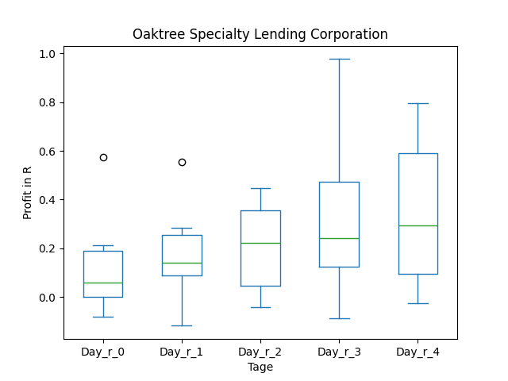
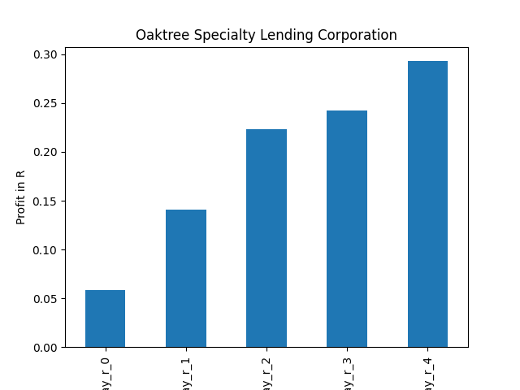

# dividend-shorter

bet on falling prices on payday **2024-12-16**.

## Signale

| Ticker   |   Divid Rate |   Close |          Volume |   last_close_volume |   Divid % | 5_Days_pos   | above_SMA_50   |
|:---------|-------------:|--------:|----------------:|--------------------:|----------:|:-------------|:---------------|
| TEN      |         0.9  |   17.97 | 611000          |            10979670 |      5.01 | False        | False          |
| STK      |         3.27 |   35.93 |  88900          |             3194177 |      9.09 | True         | True           |
| OCSL     |         0.55 |   16.04 |      1.3684e+06 |            21949136 |      3.43 | False        | False          |
| MRCC     |         0.25 |    8.55 |  69200          |              591660 |      2.92 | False        | True           |
| GECC     |         0.35 |   10.43 |  77100          |              804153 |      3.36 | True         | True           |
| EMF      |         0.51 |   12.82 |  15800          |              202556 |      3.99 | False        | False          |

## TEN

### Erwartung in R
|      |   Day_r_0 |   Day_r_1 |   Day_r_2 |   Day_r_3 |   Day_r_4 |   Treffer |
|:-----|----------:|----------:|----------:|----------:|----------:|----------:|
| ohne |        -1 |        -1 |        -1 |        -1 |        -1 |         9 |
| mit  |       nan |       nan |       nan |       nan |       nan |         0 |

### Ohne Filter

### Mit Filter

## STK

### Erwartung in R
|      |   Day_r_0 |   Day_r_1 |   Day_r_2 |   Day_r_3 |   Day_r_4 |   Treffer |
|:-----|----------:|----------:|----------:|----------:|----------:|----------:|
| ohne |       0.1 |       0.2 |       0.1 |       0.2 |       0.3 |        65 |
| mit  |       0.1 |       0.4 |       0.7 |       0.7 |       1.2 |         6 |

### Ohne Filter

### Mit Filter

## OCSL

### Erwartung in R
|      |   Day_r_0 |   Day_r_1 |   Day_r_2 |   Day_r_3 |   Day_r_4 |   Treffer |
|:-----|----------:|----------:|----------:|----------:|----------:|----------:|
| ohne |       0.1 |       0.1 |       0.2 |       0.2 |       0.1 |        94 |
| mit  |       0   |       0.1 |       0.1 |       0.1 |       0.1 |         4 |

### Ohne Filter

### Mit Filter

## MRCC

### Erwartung in R
|      |   Day_r_0 |   Day_r_1 |   Day_r_2 |   Day_r_3 |   Day_r_4 |   Treffer |
|:-----|----------:|----------:|----------:|----------:|----------:|----------:|
| ohne |       0.1 |       0.2 |       0.3 |       0.3 |       0.5 |        48 |
| mit  |       0.3 |       1.4 |       1.1 |       1.3 |       1.6 |         7 |

### Ohne Filter

### Mit Filter

## GECC

### Erwartung in R
|      |   Day_r_0 |   Day_r_1 |   Day_r_2 |   Day_r_3 |   Day_r_4 |   Treffer |
|:-----|----------:|----------:|----------:|----------:|----------:|----------:|
| ohne |       0.3 |       0.4 |       0.7 |       0.6 |       0.6 |        66 |
| mit  |     nan   |     nan   |     nan   |     nan   |     nan   |         0 |

### Ohne Filter

### Mit Filter

## EMF

### Erwartung in R
|      |   Day_r_0 |   Day_r_1 |   Day_r_2 |   Day_r_3 |   Day_r_4 |   Treffer |
|:-----|----------:|----------:|----------:|----------:|----------:|----------:|
| ohne |       0   |       0.1 |       0.1 |       0.1 |       0   |        30 |
| mit  |       0.1 |       0   |      -0.1 |      -0.1 |      -0.1 |        11 |

### Ohne Filter

### Mit Filter

