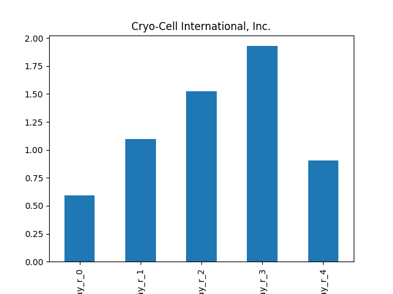

# dividend-shorter

bet on falling prices on payday **2025-02-14**.

## Signale

| Ticker   |   Divid Rate |   Close |   Volume |   last_close_volume |   Divid % | 5_Days_pos   | above_SMA_50   |
|:---------|-------------:|--------:|---------:|--------------------:|----------:|:-------------|:---------------|
| PFX      |         1.43 |   49.05 |     2400 |              117720 |      2.92 | True         | True           |
| FOSLL    |         0.44 |   14.33 |     7600 |              108908 |      3.05 | True         | True           |
| FCBC     |         2.07 |   44.05 |    43300 |             1907365 |      4.7  | False        | True           |
| CCEL     |         0.25 |    7.89 |    12700 |              100203 |      3.17 | False        | True           |

## PFX

### Erwartung in R
|      |   Day_r_0 |   Day_r_1 |   Day_r_2 |   Day_r_3 |   Day_r_4 |   Treffer |
|:-----|----------:|----------:|----------:|----------:|----------:|----------:|
| ohne |       0.1 |       0.2 |      -0.9 |        -1 |        -1 |        24 |
| mit  |     nan   |     nan   |     nan   |       nan |       nan |         0 |

### Ohne Filter

### Mit Filter

## FOSLL

### Erwartung in R
|      |   Day_r_0 |   Day_r_1 |   Day_r_2 |   Day_r_3 |   Day_r_4 |   Treffer |
|:-----|----------:|----------:|----------:|----------:|----------:|----------:|
| ohne |       0.3 |       0.6 |         1 |       1.3 |       1.1 |        10 |
| mit  |     nan   |     nan   |       nan |     nan   |     nan   |         0 |

### Ohne Filter

### Mit Filter

## FCBC

### Erwartung in R
|      |   Day_r_0 |   Day_r_1 |   Day_r_2 |   Day_r_3 |   Day_r_4 |   Treffer |
|:-----|----------:|----------:|----------:|----------:|----------:|----------:|
| ohne |      -0.1 |      -0.3 |      -0.4 |      -0.8 |        -1 |        84 |
| mit  |     nan   |     nan   |     nan   |     nan   |       nan |         0 |

### Ohne Filter

### Mit Filter

## CCEL

### Erwartung in R
|      |   Day_r_0 |   Day_r_1 |   Day_r_2 |   Day_r_3 |   Day_r_4 |   Treffer |
|:-----|----------:|----------:|----------:|----------:|----------:|----------:|
| ohne |       0.6 |       1.1 |       1.5 |       1.9 |       0.9 |         1 |
| mit  |     nan   |     nan   |     nan   |     nan   |     nan   |         0 |

### Ohne Filter

### Mit Filter

