# dividend-shorter

bet on falling prices on payday **2025-04-11**.

## Signale

| Ticker   |   Divid Rate |   Close |           Volume |   last_close_volume |   Divid % | 5_Days_pos   | above_SMA_50   |
|:---------|-------------:|--------:|-----------------:|--------------------:|----------:|:-------------|:---------------|
| VIPS     |         0.48 |   13.14 |      4.5153e+06  |            59331042 |      3.65 | False        | False          |
| SMHB     |         0.15 |    3.51 | 180600           |              633906 |      4.4  | False        | False          |
| SGBLY    |         0.42 |   11.33 |  61200           |              693396 |      3.7  | True         | False          |
| PMT      |         0.4  |   12.62 |      1.9239e+06  |            24279618 |      3.17 | False        | False          |
| NDBKY    |         0.61 |   12.55 |  26700           |              335085 |      4.83 | True         | False          |
| MVRL     |         0.53 |   12.45 |  60500           |              753225 |      4.26 | False        | False          |
| MTNOY    |         0.19 |    5.52 |  27100           |              149592 |      3.45 | True         | False          |
| MOMO     |         0.3  |    5.53 |      1.496e+06   |             8272880 |      5.42 | False        | False          |
| LYG      |         0.1  |    3.58 |      5.19823e+07 |           186096634 |      2.89 | True         | True           |
| GNL      |         0.19 |    6.93 |      3.6859e+06  |            25543287 |      2.74 | False        | False          |
| DTEGY    |         0.97 |   36.73 | 556000           |            20421880 |      2.65 | True         | True           |
| BDCZ     |         0.58 |   17    |  26000           |              442000 |      3.41 | False        | False          |
| BDCX     |         1.56 |   26.03 |  10500           |              273315 |      5.98 | False        | False          |
| AVVIY    |         0.6  |   13.77 |  36300           |              499851 |      4.36 | True         | True           |

## VIPS

### Erwartung in R
|      |   Day_r_0 |   Day_r_1 |   Day_r_2 |   Day_r_3 |   Day_r_4 |   Treffer |
|:-----|----------:|----------:|----------:|----------:|----------:|----------:|
| ohne |      -0.1 |        -0 |         0 |       0.1 |      -0.7 |         1 |
| mit  |     nan   |       nan |       nan |     nan   |     nan   |         0 |

### Ohne Filter
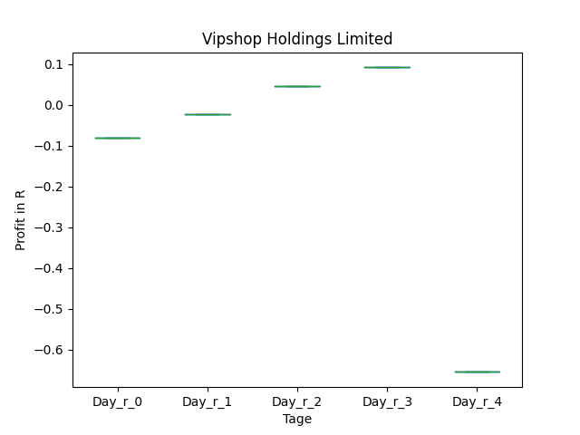
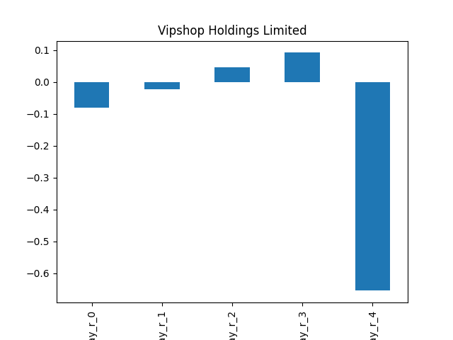

### Mit Filter

## SMHB

### Erwartung in R
|      |   Day_r_0 |   Day_r_1 |   Day_r_2 |   Day_r_3 |   Day_r_4 |   Treffer |
|:-----|----------:|----------:|----------:|----------:|----------:|----------:|
| ohne |       0.1 |      -0   |      -0.2 |      -0.6 |      -0.9 |        76 |
| mit  |       0   |       0.2 |      -0   |      -0.6 |      -0.6 |         1 |

### Ohne Filter

### Mit Filter

## SGBLY

### Erwartung in R
|      |   Day_r_0 |   Day_r_1 |   Day_r_2 |   Day_r_3 |   Day_r_4 |   Treffer |
|:-----|----------:|----------:|----------:|----------:|----------:|----------:|
| ohne |        -0 |       0.1 |       0.1 |       0.2 |      -0.2 |        25 |
| mit  |       nan |     nan   |     nan   |     nan   |     nan   |         0 |

### Ohne Filter

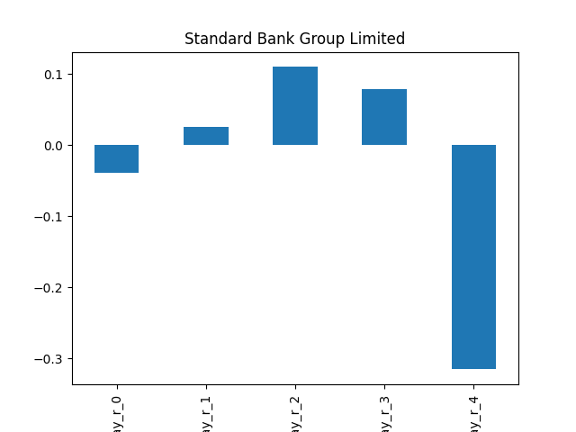

### Mit Filter

## PMT

### Erwartung in R
|      |   Day_r_0 |   Day_r_1 |   Day_r_2 |   Day_r_3 |   Day_r_4 |   Treffer |
|:-----|----------:|----------:|----------:|----------:|----------:|----------:|
| ohne |         0 |       0.1 |       0.2 |       0.1 |       0   |        59 |
| mit  |        -0 |       0   |       0.1 |       0.1 |      -0.1 |        25 |

### Ohne Filter
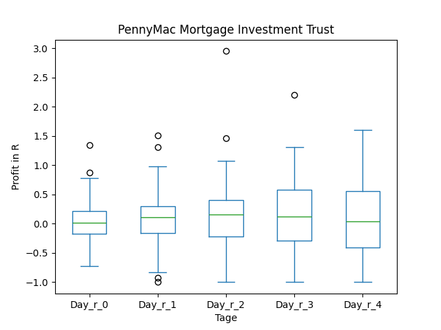

### Mit Filter

## NDBKY

### Erwartung in R
|      |   Day_r_0 |   Day_r_1 |   Day_r_2 |   Day_r_3 |   Day_r_4 |   Treffer |
|:-----|----------:|----------:|----------:|----------:|----------:|----------:|
| ohne |         0 |         0 |       0.2 |        -0 |      -0.4 |        24 |
| mit  |       nan |       nan |     nan   |       nan |     nan   |         0 |

### Ohne Filter
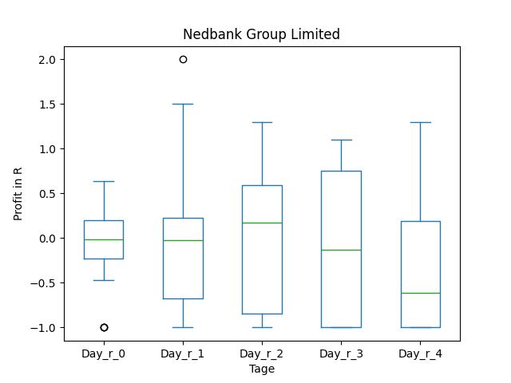
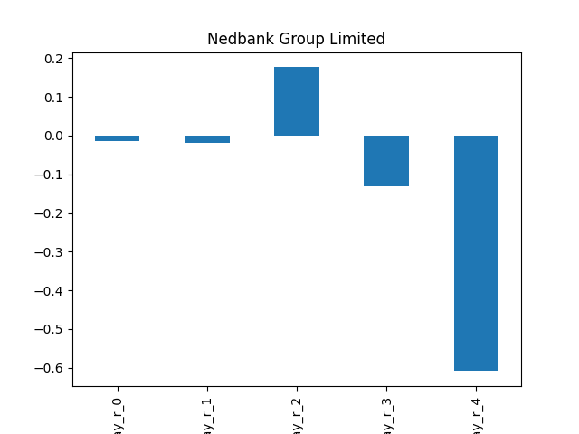

### Mit Filter

## MVRL

### Erwartung in R
|      |   Day_r_0 |   Day_r_1 |   Day_r_2 |   Day_r_3 |   Day_r_4 |   Treffer |
|:-----|----------:|----------:|----------:|----------:|----------:|----------:|
| ohne |       0.1 |      -0.2 |      -0.3 |      -0.4 |      -0.5 |        57 |
| mit  |      -0.5 |      -0.2 |      -0.5 |      -0.5 |      -1   |         1 |

### Ohne Filter

### Mit Filter

## MTNOY

### Erwartung in R
|      |   Day_r_0 |   Day_r_1 |   Day_r_2 |   Day_r_3 |   Day_r_4 |   Treffer |
|:-----|----------:|----------:|----------:|----------:|----------:|----------:|
| ohne |       0   |      -0.1 |      -0.1 |      -0.1 |      -0.1 |        20 |
| mit  |       0.1 |       0.5 |       0.6 |       1.5 |       1.5 |         3 |

### Ohne Filter

### Mit Filter

## MOMO

### Erwartung in R
|      |   Day_r_0 |   Day_r_1 |   Day_r_2 |   Day_r_3 |   Day_r_4 |   Treffer |
|:-----|----------:|----------:|----------:|----------:|----------:|----------:|
| ohne |       0.4 |       0.5 |       0.2 |       0.3 |       0.5 |         6 |
| mit  |       0.2 |       0.3 |       0.2 |       0.2 |       0.4 |         5 |

### Ohne Filter
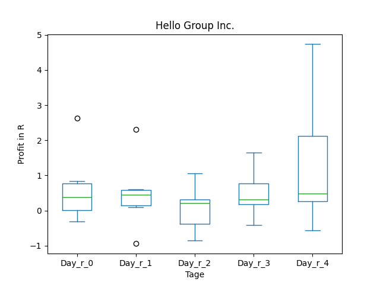
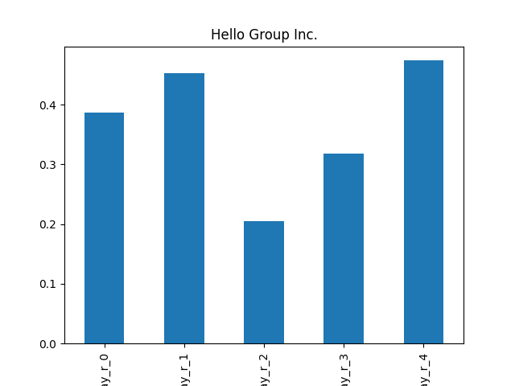

### Mit Filter
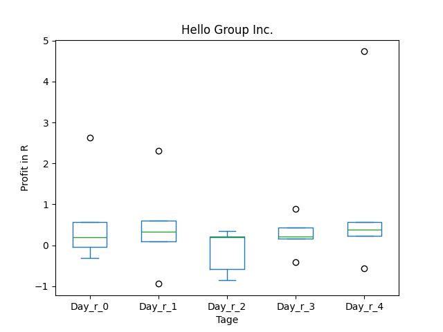
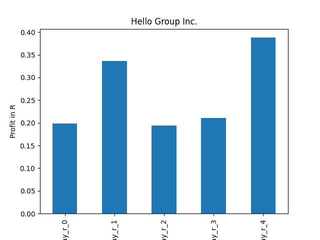

## LYG

### Erwartung in R
|      |   Day_r_0 |   Day_r_1 |   Day_r_2 |   Day_r_3 |   Day_r_4 |   Treffer |
|:-----|----------:|----------:|----------:|----------:|----------:|----------:|
| ohne |      -0   |       0.1 |       0.1 |       0.1 |      -0.1 |        30 |
| mit  |       0.1 |       0.1 |       0.1 |       0.2 |      -0   |        12 |

### Ohne Filter

### Mit Filter

## GNL

### Erwartung in R
|      |   Day_r_0 |   Day_r_1 |   Day_r_2 |   Day_r_3 |   Day_r_4 |   Treffer |
|:-----|----------:|----------:|----------:|----------:|----------:|----------:|
| ohne |       0.2 |       0.2 |       0   |      -0.2 |      -0.2 |        69 |
| mit  |       0.1 |      -0.1 |      -0.4 |      -0.6 |      -0.7 |        12 |

### Ohne Filter

### Mit Filter

## DTEGY

### Erwartung in R
|      |   Day_r_0 |   Day_r_1 |   Day_r_2 |   Day_r_3 |   Day_r_4 |   Treffer |
|:-----|----------:|----------:|----------:|----------:|----------:|----------:|
| ohne |         0 |         0 |      -0.1 |         0 |       0.4 |        12 |
| mit  |         0 |         0 |      -0.1 |         0 |       0.4 |        12 |

### Ohne Filter

### Mit Filter

## BDCZ

### Erwartung in R
|      |   Day_r_0 |   Day_r_1 |   Day_r_2 |   Day_r_3 |   Day_r_4 |   Treffer |
|:-----|----------:|----------:|----------:|----------:|----------:|----------:|
| ohne |        -0 |      -0.1 |      -0.2 |      -0.5 |      -0.5 |        37 |
| mit  |       nan |     nan   |     nan   |     nan   |     nan   |         0 |

### Ohne Filter

### Mit Filter

## BDCX

### Erwartung in R
|      |   Day_r_0 |   Day_r_1 |   Day_r_2 |   Day_r_3 |   Day_r_4 |   Treffer |
|:-----|----------:|----------:|----------:|----------:|----------:|----------:|
| ohne |      -0.1 |       0.1 |      -0.2 |      -0.1 |      -0.1 |        19 |
| mit  |     nan   |     nan   |     nan   |     nan   |     nan   |         0 |

### Ohne Filter
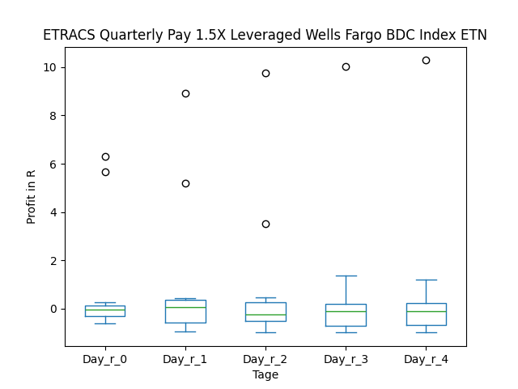
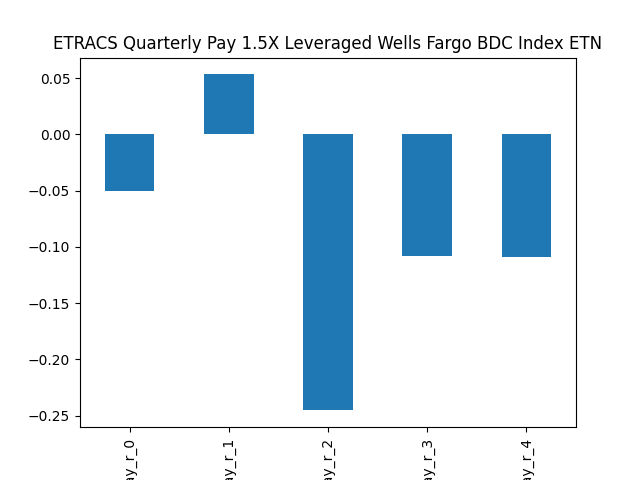

### Mit Filter

## AVVIY

### Erwartung in R
|      |   Day_r_0 |   Day_r_1 |   Day_r_2 |   Day_r_3 |   Day_r_4 |   Treffer |
|:-----|----------:|----------:|----------:|----------:|----------:|----------:|
| ohne |      -0   |         0 |       0   |      -0   |      -0.3 |        16 |
| mit  |      -0.1 |        -0 |      -0.3 |      -0.5 |      -0.5 |         2 |

### Ohne Filter

### Mit Filter

