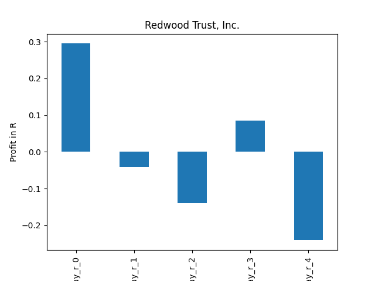

# dividend-shorter

bet on falling prices on payday **2025-12-23**.

## Signale

| Ticker   |   Divid Rate |   Close |          Volume |   last_close_volume |   Divid % | 5_Days_pos   | above_SMA_50   |
|:---------|-------------:|--------:|----------------:|--------------------:|----------:|:-------------|:---------------|
| YGLD     |         1.37 |   46.12 |  55200          |             2545824 |      2.97 | True         | True           |
| XV       |         1.22 |   26.93 |  23000          |              619390 |      4.53 | True         | True           |
| TESL     |         2.82 |   25.46 |  29300          |              745978 |     11.08 | False        | True           |
| RWT      |         0.18 |    5.73 |      1.5523e+06 |             8894679 |      3.14 | True         | True           |
| PFIX     |         2.39 |   50.71 | 224100          |            11364111 |      4.71 | False        | True           |
| MRCC     |         0.18 |    6.5  | 244500          |             1589250 |      2.77 | True         | False          |
| KF       |         0.94 |   35.98 |  34400          |             1237712 |      2.62 | True         | True           |
| CAS      |         3.59 |   34.72 |   4500          |              156240 |     10.34 | True         | True           |

## YGLD

### Erwartung in R
|      |   Day_r_0 |   Day_r_1 |   Day_r_2 |   Day_r_3 |   Day_r_4 |   Treffer |
|:-----|----------:|----------:|----------:|----------:|----------:|----------:|
| ohne |        -0 |      -0.4 |      -0.6 |      -0.8 |        -1 |         4 |
| mit  |       nan |     nan   |     nan   |     nan   |       nan |         0 |

### Ohne Filter

### Mit Filter

## XV

### Erwartung in R
|      |   Day_r_0 |   Day_r_1 |   Day_r_2 |   Day_r_3 |   Day_r_4 |   Treffer |
|:-----|----------:|----------:|----------:|----------:|----------:|----------:|
| ohne |         0 |      -0.1 |      -0.1 |      -0.2 |         0 |         7 |
| mit  |       nan |     nan   |     nan   |     nan   |       nan |         0 |

### Ohne Filter

### Mit Filter

## TESL

### Erwartung in R
|      |   Day_r_0 |   Day_r_1 |   Day_r_2 |   Day_r_3 |   Day_r_4 |   Treffer |
|:-----|----------:|----------:|----------:|----------:|----------:|----------:|
| ohne |       4.1 |       3.9 |       6.1 |         7 |         0 |         4 |
| mit  |     nan   |     nan   |     nan   |       nan |       nan |         0 |

### Ohne Filter

### Mit Filter

## RWT

### Erwartung in R
|      |   Day_r_0 |   Day_r_1 |   Day_r_2 |   Day_r_3 |   Day_r_4 |   Treffer |
|:-----|----------:|----------:|----------:|----------:|----------:|----------:|
| ohne |       0.1 |       0   |      -0.2 |      -0.1 |      -0.3 |        93 |
| mit  |       0.1 |      -0.1 |      -0.2 |      -0   |      -0.2 |        14 |

### Ohne Filter

### Mit Filter

## PFIX

### Erwartung in R
|      |   Day_r_0 |   Day_r_1 |   Day_r_2 |   Day_r_3 |   Day_r_4 |   Treffer |
|:-----|----------:|----------:|----------:|----------:|----------:|----------:|
| ohne |       0.1 |      -0.2 |        -0 |      -0.7 |        -1 |        46 |
| mit  |       0   |       0   |         0 |       0   |        -0 |         1 |

### Ohne Filter

### Mit Filter

## MRCC

### Erwartung in R
|      |   Day_r_0 |   Day_r_1 |   Day_r_2 |   Day_r_3 |   Day_r_4 |   Treffer |
|:-----|----------:|----------:|----------:|----------:|----------:|----------:|
| ohne |       0.1 |       0.3 |       0.3 |       0.4 |       0.5 |        52 |
| mit  |       0.3 |       1.4 |       1.1 |       1.3 |       1.6 |         7 |

### Ohne Filter

### Mit Filter

## KF

### Erwartung in R
|      |   Day_r_0 |   Day_r_1 |   Day_r_2 |   Day_r_3 |   Day_r_4 |   Treffer |
|:-----|----------:|----------:|----------:|----------:|----------:|----------:|
| ohne |         0 |         0 |         0 |      -0.1 |      -0.1 |        18 |
| mit  |         0 |        -0 |        -0 |      -0.1 |      -0.1 |         1 |

### Ohne Filter

### Mit Filter

## CAS

### Erwartung in R
|      |   Day_r_0 |   Day_r_1 |   Day_r_2 |   Day_r_3 |   Day_r_4 |   Treffer |
|:-----|----------:|----------:|----------:|----------:|----------:|----------:|
| ohne |         0 |       0.4 |      -0.5 |        -1 |        -1 |         3 |
| mit  |       nan |     nan   |     nan   |       nan |       nan |         0 |

### Ohne Filter

### Mit Filter

