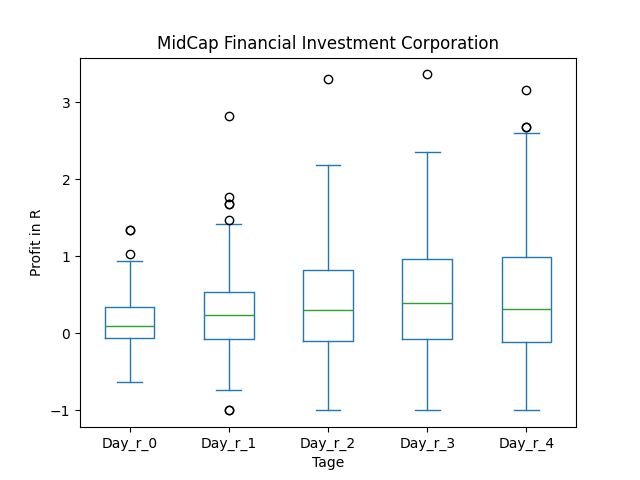

# dividend-shorter

bet on falling prices on payday **2025-03-11**.

## Signale

| Ticker   |   Divid Rate |   Close |     Volume |   last_close_volume |   Divid % | 5_Days_pos   | above_SMA_50   |
|:---------|-------------:|--------:|-----------:|--------------------:|----------:|:-------------|:---------------|
| MFIC     |         0.38 |   13.08 | 1.3184e+06 |            17244672 |      2.91 | False        | False          |

## MFIC

### Erwartung in R
|      |   Day_r_0 |   Day_r_1 |   Day_r_2 |   Day_r_3 |   Day_r_4 |   Treffer |
|:-----|----------:|----------:|----------:|----------:|----------:|----------:|
| ohne |       0.1 |       0.2 |       0.3 |       0.4 |       0.3 |        73 |
| mit  |       0.4 |       0.5 |       0.7 |       0.8 |       0.4 |        11 |

### Ohne Filter

### Mit Filter

