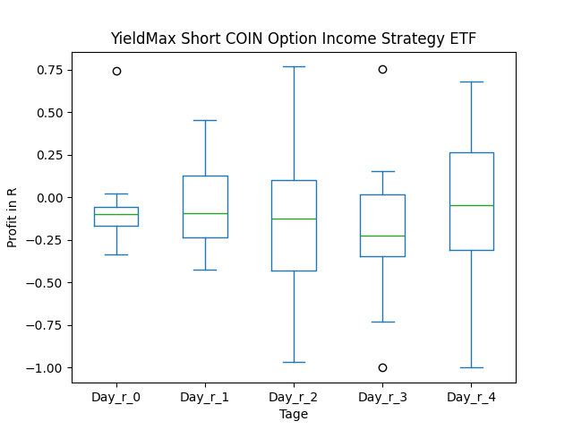
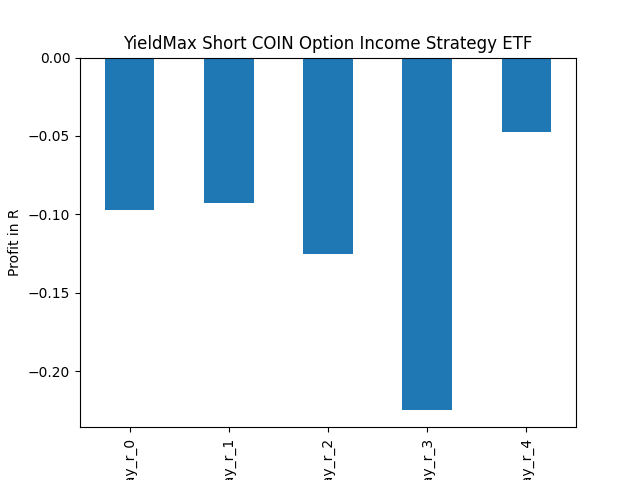
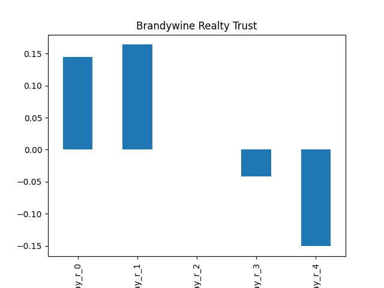

# dividend-shorter

bet on falling prices on payday **2025-01-08**.

## Signale

| Ticker   |   Divid Rate |   Close |          Volume |   last_close_volume |   Divid % | 5_Days_pos   | above_SMA_50   |
|:---------|-------------:|--------:|----------------:|--------------------:|----------:|:-------------|:---------------|
| ULTY     |         0.57 |    9.12 |      2.4743e+06 |            22565616 |      6.27 | True         | False          |
| NFLY     |         0.58 |   18.01 | 279800          |             5039198 |      3.24 | False        | False          |
| FIAT     |         0.65 |    9.01 | 674900          |             6080849 |      7.25 | False        | False          |
| CONY     |         0.83 |   13.46 |      9.4686e+06 |           127447356 |      6.2  | True         | False          |
| BDN      |         0.15 |    5.39 |      3.6615e+06 |            19735485 |      2.78 | False        | False          |
| AMDY     |         0.34 |   10.5  | 797200          |             8370600 |      3.24 | True         | False          |
| ABNY     |         0.42 |   14.94 |  12500          |              186750 |      2.82 | False        | False          |

## ULTY

### Erwartung in R
|      |   Day_r_0 |   Day_r_1 |   Day_r_2 |   Day_r_3 |   Day_r_4 |   Treffer |
|:-----|----------:|----------:|----------:|----------:|----------:|----------:|
| ohne |       0.2 |       0.2 |       0.2 |       0.1 |       0.3 |        10 |
| mit  |       0.2 |       0.2 |       0.2 |       0.1 |       0.3 |        10 |

### Ohne Filter

### Mit Filter

## NFLY

### Erwartung in R
|      |   Day_r_0 |   Day_r_1 |   Day_r_2 |   Day_r_3 |   Day_r_4 |   Treffer |
|:-----|----------:|----------:|----------:|----------:|----------:|----------:|
| ohne |       0.1 |       0.1 |        -0 |         0 |      -0.2 |        16 |
| mit  |       0.1 |       0.1 |        -0 |         0 |      -0.2 |         7 |

### Ohne Filter

### Mit Filter

## FIAT

### Erwartung in R
|      |   Day_r_0 |   Day_r_1 |   Day_r_2 |   Day_r_3 |   Day_r_4 |   Treffer |
|:-----|----------:|----------:|----------:|----------:|----------:|----------:|
| ohne |      -0.1 |      -0.1 |        -0 |      -0.1 |      -0.2 |         5 |
| mit  |      -0.1 |      -0.1 |        -0 |      -0.1 |      -0.2 |         5 |

### Ohne Filter

### Mit Filter

## CONY

### Erwartung in R
|      |   Day_r_0 |   Day_r_1 |   Day_r_2 |   Day_r_3 |   Day_r_4 |   Treffer |
|:-----|----------:|----------:|----------:|----------:|----------:|----------:|
| ohne |        -0 |      -0.2 |      -0.2 |      -0.2 |      -0.1 |        15 |
| mit  |        -0 |      -0.2 |      -0.2 |      -0.2 |      -0.1 |        15 |

### Ohne Filter

### Mit Filter

## BDN

### Erwartung in R
|      |   Day_r_0 |   Day_r_1 |   Day_r_2 |   Day_r_3 |   Day_r_4 |   Treffer |
|:-----|----------:|----------:|----------:|----------:|----------:|----------:|
| ohne |       0.1 |       0.1 |      -0   |      -0.1 |      -0.2 |        80 |
| mit  |       0.1 |       0.3 |       0.1 |       0.3 |       0.2 |         9 |

### Ohne Filter

### Mit Filter

## AMDY

### Erwartung in R
|      |   Day_r_0 |   Day_r_1 |   Day_r_2 |   Day_r_3 |   Day_r_4 |   Treffer |
|:-----|----------:|----------:|----------:|----------:|----------:|----------:|
| ohne |      -0.1 |      -0.1 |      -0.2 |      -0.3 |      -0.3 |        14 |
| mit  |      -0   |      -0.1 |      -0.2 |      -0.3 |      -0.3 |        13 |

### Ohne Filter

### Mit Filter

## ABNY

### Erwartung in R
|      |   Day_r_0 |   Day_r_1 |   Day_r_2 |   Day_r_3 |   Day_r_4 |   Treffer |
|:-----|----------:|----------:|----------:|----------:|----------:|----------:|
| ohne |         0 |         0 |         0 |       0.1 |      -0.2 |         5 |
| mit  |       nan |       nan |       nan |     nan   |     nan   |         0 |

### Ohne Filter

### Mit Filter

