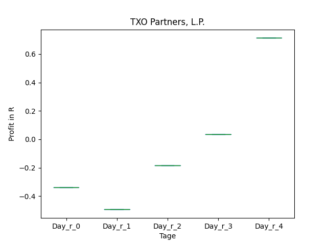
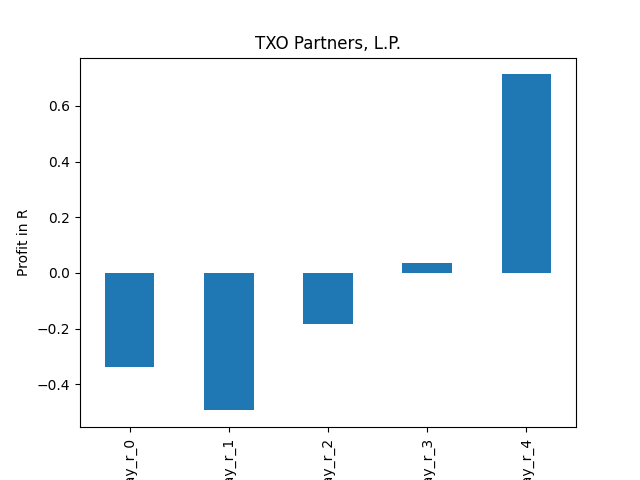

# dividend-shorter

bet on falling prices on payday **2025-11-14**.

## Signale

| Ticker   |   Divid Rate |   Close |           Volume |   last_close_volume |   Divid % | 5_Days_pos   | above_SMA_50   |
|:---------|-------------:|--------:|-----------------:|--------------------:|----------:|:-------------|:---------------|
| USA      |         0.17 |    6.24 |      1.10197e+06 |             6876287 |      2.72 | True         | False          |
| TXO      |         0.35 |   13.85 | 253902           |             3516543 |      2.53 | True         | True           |
| OXLC     |         0.4  |   14.91 |      1.34138e+06 |            20000035 |      2.68 | False        | False          |
| NRT      |         0.31 |    6.55 | 164016           |             1074305 |      4.73 | False        | True           |
| MHNC     |         0.48 |   17.59 |  13235           |              232804 |      2.75 | False        | False          |
| FGBIP    |         0.42 |   16.1  |  12038           |              193812 |      2.62 | True         | False          |
| CET      |         2.45 |   51.03 |  80575           |             4111742 |      4.8  | True         | False          |
| ABR      |         0.3  |    9.08 |      3.32984e+06 |            30234902 |      3.3  | False        | False          |

## USA

### Erwartung in R
|      |   Day_r_0 |   Day_r_1 |   Day_r_2 |   Day_r_3 |   Day_r_4 |   Treffer |
|:-----|----------:|----------:|----------:|----------:|----------:|----------:|
| ohne |       0.1 |       0.2 |       0   |       0.1 |      -0.1 |        69 |
| mit  |      -0.1 |      -0.1 |      -0.1 |      -0.3 |      -0.5 |         4 |

### Ohne Filter

### Mit Filter

## TXO

### Erwartung in R
|      |   Day_r_0 |   Day_r_1 |   Day_r_2 |   Day_r_3 |   Day_r_4 |   Treffer |
|:-----|----------:|----------:|----------:|----------:|----------:|----------:|
| ohne |        -0 |      -0.2 |      -0.1 |      -0.1 |       0   |        10 |
| mit  |         0 |       0.1 |       0.3 |       0.2 |       0.4 |         4 |

### Ohne Filter

### Mit Filter

## OXLC

### Erwartung in R
|      |   Day_r_0 |   Day_r_1 |   Day_r_2 |   Day_r_3 |   Day_r_4 |   Treffer |
|:-----|----------:|----------:|----------:|----------:|----------:|----------:|
| ohne |       0.2 |       0.4 |       0.5 |       0.5 |       0.5 |       123 |
| mit  |     nan   |     nan   |     nan   |     nan   |     nan   |         0 |

### Ohne Filter

### Mit Filter

## NRT

### Erwartung in R
|      |   Day_r_0 |   Day_r_1 |   Day_r_2 |   Day_r_3 |   Day_r_4 |   Treffer |
|:-----|----------:|----------:|----------:|----------:|----------:|----------:|
| ohne |       0.2 |       0.3 |       0.5 |       0.6 |       0.5 |        78 |
| mit  |       0.3 |       1.4 |       1.1 |       1.3 |       1.8 |         3 |

### Ohne Filter

### Mit Filter

## MHNC

### Erwartung in R
|      |   Day_r_0 |   Day_r_1 |   Day_r_2 |   Day_r_3 |   Day_r_4 |   Treffer |
|:-----|----------:|----------:|----------:|----------:|----------:|----------:|
| ohne |       0.1 |       0.1 |       0.2 |       0.2 |       0.4 |        39 |
| mit  |     nan   |     nan   |     nan   |     nan   |     nan   |         0 |

### Ohne Filter

### Mit Filter

## FGBIP

### Erwartung in R
|      |   Day_r_0 |   Day_r_1 |   Day_r_2 |   Day_r_3 |   Day_r_4 |   Treffer |
|:-----|----------:|----------:|----------:|----------:|----------:|----------:|
| ohne |         0 |        -0 |         0 |         0 |       0.2 |        18 |
| mit  |       nan |       nan |       nan |       nan |     nan   |         0 |

### Ohne Filter

### Mit Filter

## CET

### Erwartung in R
|      |   Day_r_0 |   Day_r_1 |   Day_r_2 |   Day_r_3 |   Day_r_4 |   Treffer |
|:-----|----------:|----------:|----------:|----------:|----------:|----------:|
| ohne |       0.1 |       0.1 |       0.1 |       0.3 |       0.1 |        55 |
| mit  |       0.1 |       0.1 |       0.1 |       0.2 |       0.1 |         3 |

### Ohne Filter

### Mit Filter

## ABR

### Erwartung in R
|      |   Day_r_0 |   Day_r_1 |   Day_r_2 |   Day_r_3 |   Day_r_4 |   Treffer |
|:-----|----------:|----------:|----------:|----------:|----------:|----------:|
| ohne |         0 |       0.2 |       0.2 |       0.2 |       0.2 |        72 |
| mit  |         0 |       0.5 |       0.4 |       0.3 |       0.4 |        17 |

### Ohne Filter

### Mit Filter

