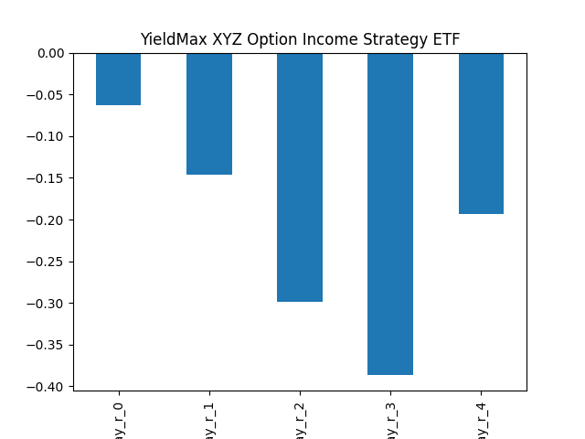
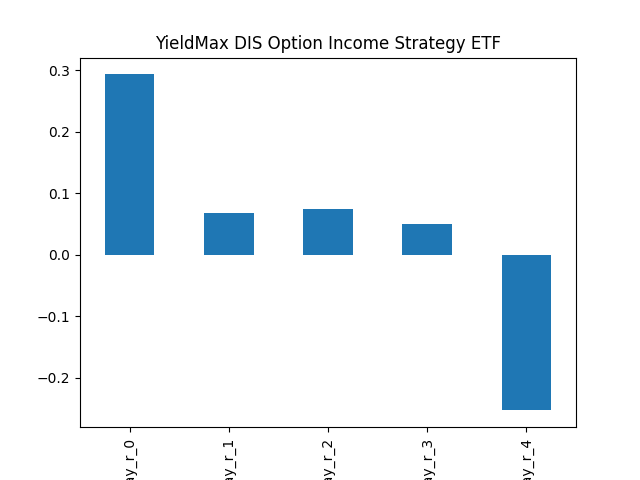

# dividend-shorter

bet on falling prices on payday **2025-04-10**.

## Signale

| Ticker   |   Divid Rate |   Close |           Volume |   last_close_volume |   Divid % | 5_Days_pos   | above_SMA_50   |
|:---------|-------------:|--------:|-----------------:|--------------------:|----------:|:-------------|:---------------|
| YQQQ     |         0.44 |   17    | 173300           |             2946100 |      2.61 | False        | True           |
| XYZY     |         0.44 |   10.63 |  90900           |              966267 |      4.15 | True         | False          |
| SWRAY    |         0.27 |    8.34 | 112200           |              935748 |      3.24 | False        | False          |
| SMCY     |         1.5  |   21.26 |      1.2322e+06  |            26196572 |      7.06 | True         | False          |
| MSTY     |         1.34 |   21.01 |      1.11599e+07 |           234469499 |      6.36 | True         | False          |
| DISO     |         0.33 |   12.94 |  50000           |              647000 |      2.51 | True         | False          |
| AMZY     |         0.49 |   15.77 | 293000           |             4620610 |      3.09 | True         | False          |
| AIYY     |         0.23 |    4.79 | 641400           |             3072306 |      4.8  | True         | False          |

## YQQQ

### Erwartung in R
|      |   Day_r_0 |   Day_r_1 |   Day_r_2 |   Day_r_3 |   Day_r_4 |   Treffer |
|:-----|----------:|----------:|----------:|----------:|----------:|----------:|
| ohne |      -0.1 |       0.1 |       0.3 |       0.6 |       0.4 |         7 |
| mit  |     nan   |     nan   |     nan   |     nan   |     nan   |         0 |

### Ohne Filter

### Mit Filter

## XYZY

### Erwartung in R
|      |   Day_r_0 |   Day_r_1 |   Day_r_2 |   Day_r_3 |   Day_r_4 |   Treffer |
|:-----|----------:|----------:|----------:|----------:|----------:|----------:|
| ohne |       nan |       nan |       nan |       nan |       nan |         0 |
| mit  |       nan |       nan |       nan |       nan |       nan |         0 |

### Ohne Filter

### Mit Filter

## SWRAY

### Erwartung in R
|      |   Day_r_0 |   Day_r_1 |   Day_r_2 |   Day_r_3 |   Day_r_4 |   Treffer |
|:-----|----------:|----------:|----------:|----------:|----------:|----------:|
| ohne |       0   |      -0.3 |      -0.3 |      -0.2 |      -0.2 |        39 |
| mit  |      -0.7 |      -0.6 |      -0.7 |      -0.6 |      -0.6 |         1 |

### Ohne Filter

### Mit Filter

## SMCY

### Erwartung in R
|      |   Day_r_0 |   Day_r_1 |   Day_r_2 |   Day_r_3 |   Day_r_4 |   Treffer |
|:-----|----------:|----------:|----------:|----------:|----------:|----------:|
| ohne |       0.1 |      -0.2 |      -0.2 |      -0.5 |      -0.4 |         6 |
| mit  |       0.1 |      -0.2 |      -0.2 |      -0.5 |      -0.4 |         6 |

### Ohne Filter

### Mit Filter

## MSTY

### Erwartung in R
|      |   Day_r_0 |   Day_r_1 |   Day_r_2 |   Day_r_3 |   Day_r_4 |   Treffer |
|:-----|----------:|----------:|----------:|----------:|----------:|----------:|
| ohne |         0 |      -0.1 |      -0.1 |      -0.1 |         0 |        12 |
| mit  |         0 |      -0.1 |      -0.1 |      -0.1 |         0 |        12 |

### Ohne Filter

### Mit Filter

## DISO

### Erwartung in R
|      |   Day_r_0 |   Day_r_1 |   Day_r_2 |   Day_r_3 |   Day_r_4 |   Treffer |
|:-----|----------:|----------:|----------:|----------:|----------:|----------:|
| ohne |       0.3 |       0.1 |       0.2 |       0.1 |      -0.2 |        18 |
| mit  |      -0.3 |       3   |       2.9 |       2.7 |       2.9 |         1 |

### Ohne Filter

### Mit Filter

## AMZY

### Erwartung in R
|      |   Day_r_0 |   Day_r_1 |   Day_r_2 |   Day_r_3 |   Day_r_4 |   Treffer |
|:-----|----------:|----------:|----------:|----------:|----------:|----------:|
| ohne |         0 |      -0.1 |      -0.2 |      -0.3 |      -0.3 |        19 |
| mit  |        -0 |       0   |      -0.1 |      -0.2 |      -0.2 |        10 |

### Ohne Filter

### Mit Filter

## AIYY

### Erwartung in R
|      |   Day_r_0 |   Day_r_1 |   Day_r_2 |   Day_r_3 |   Day_r_4 |   Treffer |
|:-----|----------:|----------:|----------:|----------:|----------:|----------:|
| ohne |       0.1 |       0   |      -0.3 |      -0.2 |      -0.2 |        15 |
| mit  |       0.1 |       0.1 |      -0.2 |      -0.2 |      -0.2 |        10 |

### Ohne Filter

### Mit Filter

