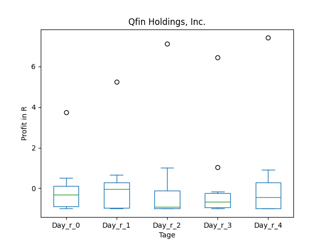

# dividend-shorter

bet on falling prices on payday **2025-09-08**.

## Signale

| Ticker   |   Divid Rate |   Close |         Volume |   last_close_volume |   Divid % | 5_Days_pos   | above_SMA_50   |
|:---------|-------------:|--------:|---------------:|--------------------:|----------:|:-------------|:---------------|
| SSLZY    |         0.13 |    5.18 | 49200          |              254856 |      2.59 | False        | True           |
| QFIN     |         0.76 |   28.77 |     1.5873e+06 |            45666621 |      2.64 | False        | False          |

## SSLZY

### Erwartung in R
|      |   Day_r_0 |   Day_r_1 |   Day_r_2 |   Day_r_3 |   Day_r_4 |   Treffer |
|:-----|----------:|----------:|----------:|----------:|----------:|----------:|
| ohne |       0   |      -0.7 |      -0.7 |      -1   |      -1   |        23 |
| mit  |      -0.7 |       0   |       0.4 |      -0.8 |      -0.4 |         1 |

### Ohne Filter

### Mit Filter

## QFIN

### Erwartung in R
|      |   Day_r_0 |   Day_r_1 |   Day_r_2 |   Day_r_3 |   Day_r_4 |   Treffer |
|:-----|----------:|----------:|----------:|----------:|----------:|----------:|
| ohne |      -0.3 |      -0   |      -0.9 |      -0.7 |      -0.4 |        10 |
| mit  |       0.1 |      -0.1 |       0   |       0.3 |       0.2 |         2 |

### Ohne Filter

### Mit Filter

