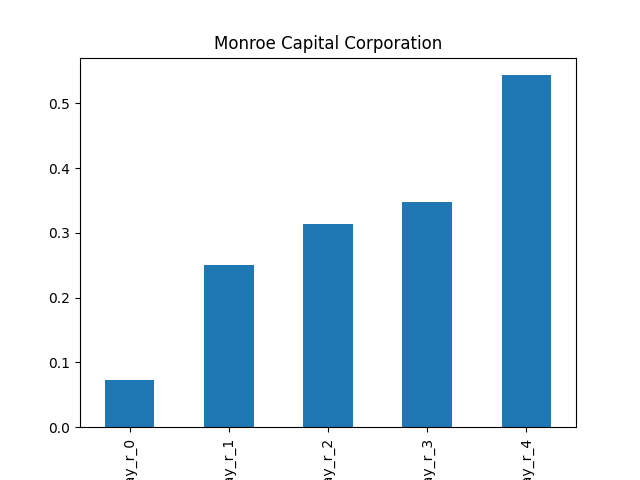

# dividend-shorter

bet on falling prices on payday **2025-09-22**.

## Signale

| Ticker   |   Divid Rate |   Close |          Volume |   last_close_volume |   Divid % | 5_Days_pos   | above_SMA_50   |
|:---------|-------------:|--------:|----------------:|--------------------:|----------:|:-------------|:---------------|
| MRRTY    |         0.52 |    4.92 |  48900          |              240588 |     10.53 | True         | True           |
| MRCC     |         0.25 |    7.69 | 297300          |             2286237 |      3.25 | True         | True           |
| BRFS     |         0.34 |    3.82 |      4.7455e+06 |            18127810 |      8.85 | False        | True           |

## MRRTY

### Erwartung in R
|      |   Day_r_0 |   Day_r_1 |   Day_r_2 |   Day_r_3 |   Day_r_4 |   Treffer |
|:-----|----------:|----------:|----------:|----------:|----------:|----------:|
| ohne |      -0.1 |       0.1 |       0.6 |       0.6 |       0.4 |         7 |
| mit  |     nan   |     nan   |     nan   |     nan   |     nan   |         0 |

### Ohne Filter

### Mit Filter

## MRCC

### Erwartung in R
|      |   Day_r_0 |   Day_r_1 |   Day_r_2 |   Day_r_3 |   Day_r_4 |   Treffer |
|:-----|----------:|----------:|----------:|----------:|----------:|----------:|
| ohne |       0.1 |       0.3 |       0.3 |       0.3 |       0.5 |        51 |
| mit  |       0.3 |       1.4 |       1.1 |       1.3 |       1.6 |         7 |

### Ohne Filter

### Mit Filter

## BRFS

### Erwartung in R
|      |   Day_r_0 |   Day_r_1 |   Day_r_2 |   Day_r_3 |   Day_r_4 |   Treffer |
|:-----|----------:|----------:|----------:|----------:|----------:|----------:|
| ohne |       0.3 |       0.1 |       0.3 |      -1   |      -1   |        32 |
| mit  |      30.9 |      15.8 |      44.5 |      33.5 |      42.7 |         2 |

### Ohne Filter

### Mit Filter

