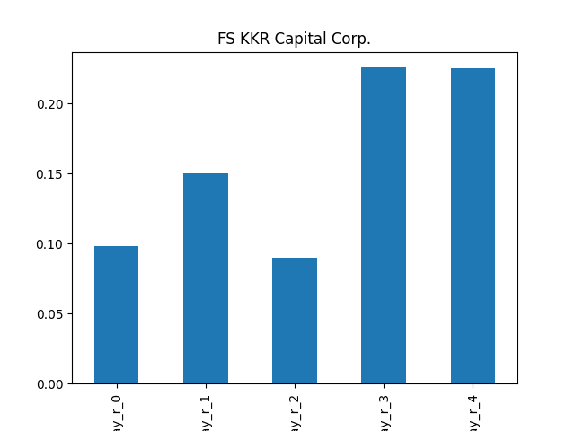

# dividend-shorter

bet on falling prices on payday **2025-03-19**.

## Signale

| Ticker   |   Divid Rate |   Close |          Volume |   last_close_volume |   Divid % | 5_Days_pos   | above_SMA_50   |
|:---------|-------------:|--------:|----------------:|--------------------:|----------:|:-------------|:---------------|
| FSK      |         0.64 |   21.25 |      3.3854e+06 |            71939750 |      3.01 | False        | False          |
| CABGY    |         0.76 |   26.42 | 978400          |            25849328 |      2.87 | True         | True           |

## FSK

### Erwartung in R
|      |   Day_r_0 |   Day_r_1 |   Day_r_2 |   Day_r_3 |   Day_r_4 |   Treffer |
|:-----|----------:|----------:|----------:|----------:|----------:|----------:|
| ohne |       0.1 |       0.1 |       0.1 |       0.2 |       0.2 |        67 |
| mit  |       0.1 |       0.1 |       0.2 |       0.2 |       0.4 |        18 |

### Ohne Filter

### Mit Filter

## CABGY

### Erwartung in R
|      |   Day_r_0 |   Day_r_1 |   Day_r_2 |   Day_r_3 |   Day_r_4 |   Treffer |
|:-----|----------:|----------:|----------:|----------:|----------:|----------:|
| ohne |      -0.1 |      -0.2 |      -0.5 |      -0.6 |      -0.5 |        13 |
| mit  |       0.5 |       0.2 |       0   |       0   |      -0.2 |         2 |

### Ohne Filter

### Mit Filter

