# dividend-shorter

bet on falling prices on payday **2025-03-20**.

## Signale

| Ticker   |   Divid Rate |   Close |          Volume |   last_close_volume |   Divid % | 5_Days_pos   | above_SMA_50   |
|:---------|-------------:|--------:|----------------:|--------------------:|----------:|:-------------|:---------------|
| YBIT     |         0.44 |   10.37 | 216900          |             2249253 |      4.2  | True         | False          |
| TSMY     |         0.58 |   15.77 |  87300          |             1376721 |      3.66 | True         | False          |
| TSLY     |         0.46 |    8.21 |      5.0787e+06 |            41696127 |      5.65 | False        | False          |
| TRMD     |         0.6  |   19.96 | 822900          |            16425084 |      3.01 | True         | True           |
| SNOY     |         0.81 |   16.82 | 310300          |             5219246 |      4.83 | True         | False          |
| RKT      |         0.8  |   14.9  |      6.7052e+06 |            99907480 |      5.37 | True         | True           |
| OARK     |         0.32 |    8.36 | 135900          |             1136124 |      3.84 | True         | False          |
| GOOY     |         0.33 |   12.83 |  95100          |             1220133 |      2.56 | True         | False          |
| CRSH     |         0.65 |    8.26 | 945000          |             7805700 |      7.82 | True         | True           |
| AMKBY    |         0.78 |    9.35 | 305600          |             2857360 |      8.38 | True         | True           |

## YBIT

### Erwartung in R
|      |   Day_r_0 |   Day_r_1 |   Day_r_2 |   Day_r_3 |   Day_r_4 |   Treffer |
|:-----|----------:|----------:|----------:|----------:|----------:|----------:|
| ohne |       0.2 |       0.1 |       0.1 |         0 |      -0.1 |        10 |
| mit  |       0.2 |       0.1 |       0.1 |         0 |      -0.1 |        10 |

### Ohne Filter

### Mit Filter

## TSMY

### Erwartung in R
|      |   Day_r_0 |   Day_r_1 |   Day_r_2 |   Day_r_3 |   Day_r_4 |   Treffer |
|:-----|----------:|----------:|----------:|----------:|----------:|----------:|
| ohne |      -0.1 |      -0.1 |       0.4 |       0.1 |      -0.1 |         6 |
| mit  |      -0.2 |      -0.5 |      -0.5 |      -0.6 |      -0.6 |         2 |

### Ohne Filter

### Mit Filter

## TSLY

### Erwartung in R
|      |   Day_r_0 |   Day_r_1 |   Day_r_2 |   Day_r_3 |   Day_r_4 |   Treffer |
|:-----|----------:|----------:|----------:|----------:|----------:|----------:|
| ohne |       0.1 |      -0   |       0   |       0.1 |      -0.1 |        27 |
| mit  |       0.1 |       0.3 |       0.4 |       0.3 |       0.1 |        14 |

### Ohne Filter

### Mit Filter
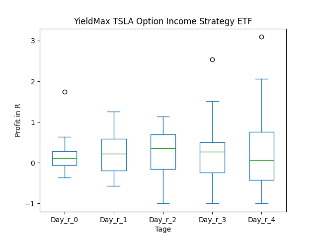

## TRMD

### Erwartung in R
|      |   Day_r_0 |   Day_r_1 |   Day_r_2 |   Day_r_3 |   Day_r_4 |   Treffer |
|:-----|----------:|----------:|----------:|----------:|----------:|----------:|
| ohne |         0 |       0.1 |       0.5 |       0.4 |       0.7 |        11 |
| mit  |         0 |       0.1 |       0.3 |       0.4 |       0.7 |        10 |

### Ohne Filter
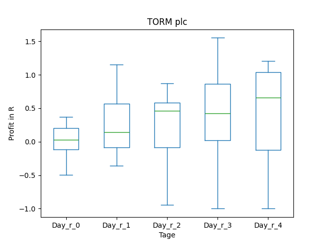

### Mit Filter
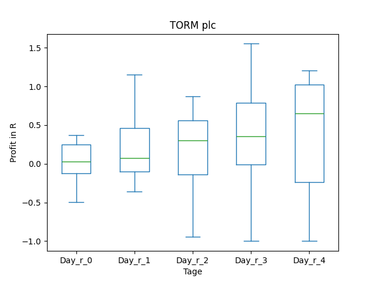
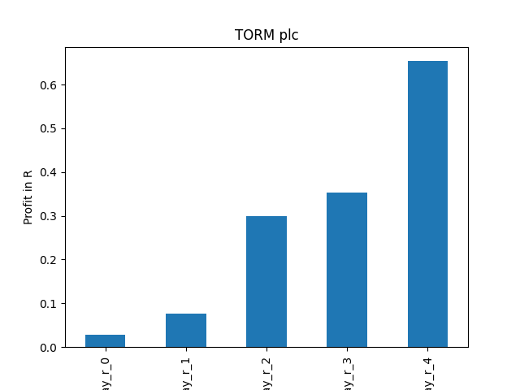

## SNOY

### Erwartung in R
|      |   Day_r_0 |   Day_r_1 |   Day_r_2 |   Day_r_3 |   Day_r_4 |   Treffer |
|:-----|----------:|----------:|----------:|----------:|----------:|----------:|
| ohne |       0.2 |       0.2 |       0.1 |      -0.1 |      -0.4 |         9 |
| mit  |       0.1 |       0.6 |       0.7 |       0.4 |       0.1 |         3 |

### Ohne Filter

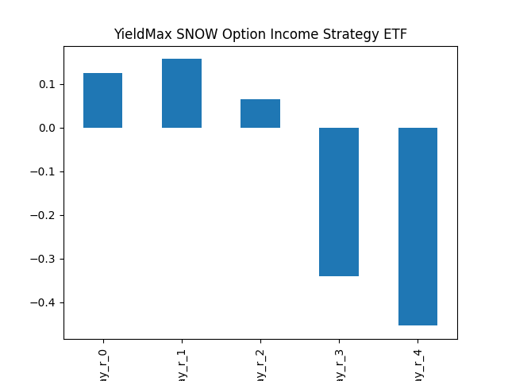

### Mit Filter

## RKT

### Erwartung in R
|      |   Day_r_0 |   Day_r_1 |   Day_r_2 |   Day_r_3 |   Day_r_4 |   Treffer |
|:-----|----------:|----------:|----------:|----------:|----------:|----------:|
| ohne |       0.4 |       0.6 |       0.4 |       0.7 |         1 |         2 |
| mit  |       0.4 |       0.6 |       0.4 |       0.7 |         1 |         2 |

### Ohne Filter

### Mit Filter

## OARK

### Erwartung in R
|      |   Day_r_0 |   Day_r_1 |   Day_r_2 |   Day_r_3 |   Day_r_4 |   Treffer |
|:-----|----------:|----------:|----------:|----------:|----------:|----------:|
| ohne |       0.1 |      -0.1 |      -0.1 |      -0.2 |      -0.3 |        27 |
| mit  |       0.1 |       0.4 |       0.5 |       0.2 |       0.1 |        13 |

### Ohne Filter
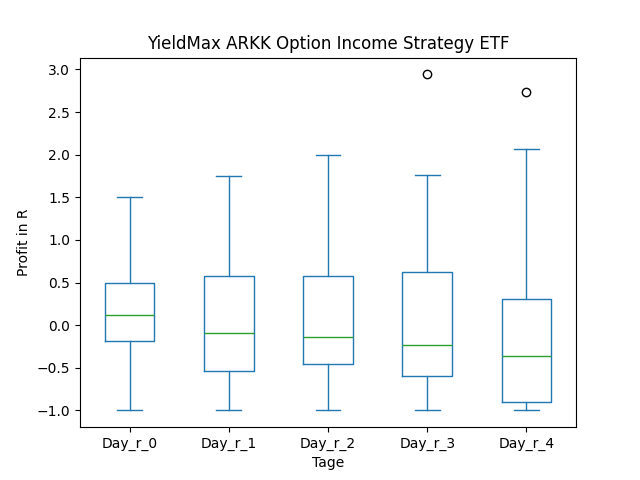

### Mit Filter

## GOOY

### Erwartung in R
|      |   Day_r_0 |   Day_r_1 |   Day_r_2 |   Day_r_3 |   Day_r_4 |   Treffer |
|:-----|----------:|----------:|----------:|----------:|----------:|----------:|
| ohne |       0.1 |      -0.1 |      -0.1 |      -0.2 |      -0.2 |        19 |
| mit  |       0.1 |       0.4 |       0.4 |       0.2 |       0   |         2 |

### Ohne Filter
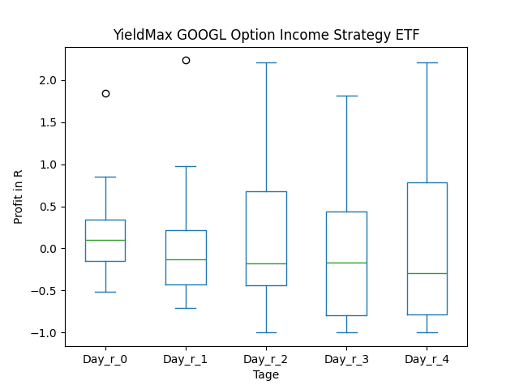

### Mit Filter

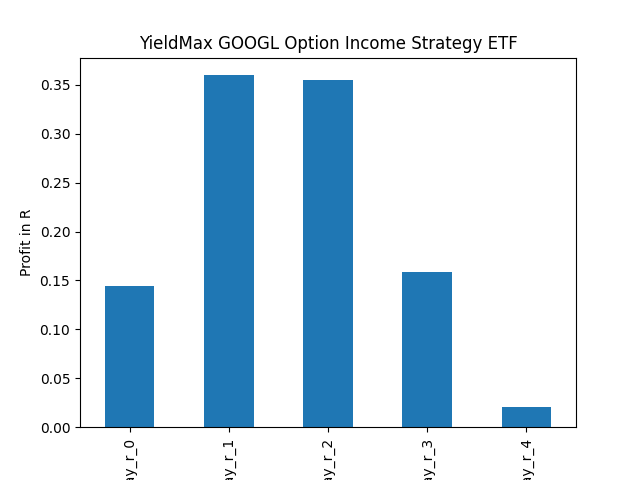

## CRSH

### Erwartung in R
|      |   Day_r_0 |   Day_r_1 |   Day_r_2 |   Day_r_3 |   Day_r_4 |   Treffer |
|:-----|----------:|----------:|----------:|----------:|----------:|----------:|
| ohne |      -0.2 |      -0.2 |      -0.3 |      -0.2 |      -0.2 |        10 |
| mit  |      -0.1 |      -0.1 |      -0.5 |      -0.2 |      -0.4 |         7 |

### Ohne Filter

### Mit Filter

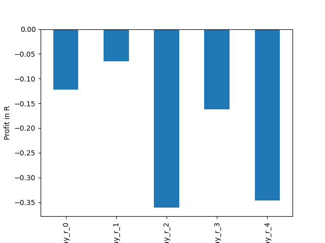

## AMKBY

### Erwartung in R
|      |   Day_r_0 |   Day_r_1 |   Day_r_2 |   Day_r_3 |   Day_r_4 |   Treffer |
|:-----|----------:|----------:|----------:|----------:|----------:|----------:|
| ohne |      -0.1 |      -0.1 |      -0.1 |      -0.7 |      -0.4 |        15 |
| mit  |      -0.1 |      -0.1 |      -0.1 |      -0.4 |      -0.3 |         6 |

### Ohne Filter
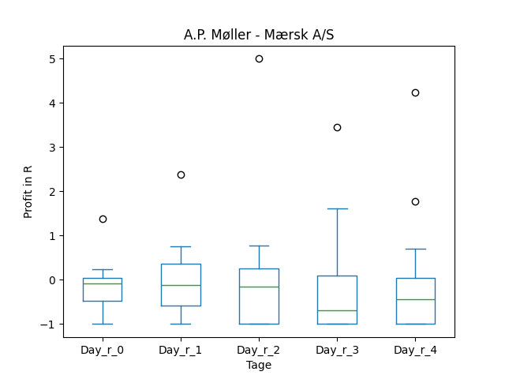

### Mit Filter
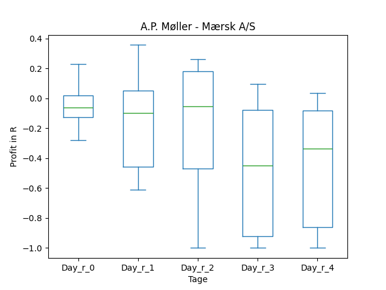

