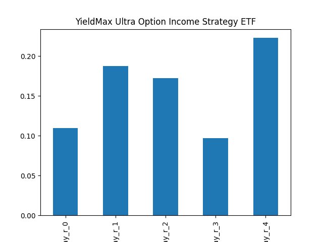
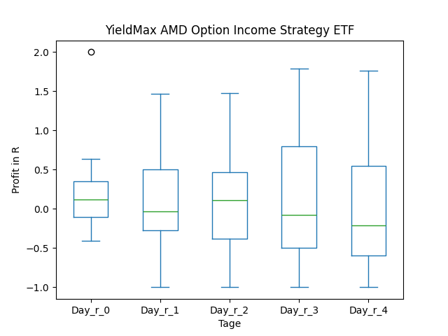

# dividend-shorter

bet on falling prices on payday **2025-02-06**.

## Signale

| Ticker   |   Divid Rate |   Close |          Volume |   last_close_volume |   Divid % | 5_Days_pos   | above_SMA_50   |
|:---------|-------------:|--------:|----------------:|--------------------:|----------:|:-------------|:---------------|
| ULTY     |         0.54 |    8.7  |      1.9147e+06 |            16657890 |      6.17 | False        | False          |
| PYPY     |         0.67 |   16.26 | 124400          |             2022744 |      4.1  | False        | False          |
| NFLY     |         1.07 |   19.42 | 593100          |            11518002 |      5.51 | True         | True           |
| FIAT     |         0.55 |    8.01 | 639600          |             5123196 |      6.86 | True         | False          |
| CONY     |         1.05 |   13.12 |      8.6213e+06 |           113111456 |      7.98 | False        | False          |
| AMDY     |         0.38 |    9.15 |      2.6353e+06 |            24112995 |      4.17 | False        | False          |
| ABNY     |         0.4  |   14.57 |  10900          |              158813 |      2.77 | False        | False          |

## ULTY

### Erwartung in R
|      |   Day_r_0 |   Day_r_1 |   Day_r_2 |   Day_r_3 |   Day_r_4 |   Treffer |
|:-----|----------:|----------:|----------:|----------:|----------:|----------:|
| ohne |       0.1 |       0.2 |       0.2 |       0.1 |       0.2 |        11 |
| mit  |       0.1 |       0.2 |       0.2 |       0.1 |       0.2 |        11 |

### Ohne Filter

### Mit Filter

## PYPY

### Erwartung in R
|      |   Day_r_0 |   Day_r_1 |   Day_r_2 |   Day_r_3 |   Day_r_4 |   Treffer |
|:-----|----------:|----------:|----------:|----------:|----------:|----------:|
| ohne |       0.2 |       0.1 |       0.1 |       0   |       0   |        15 |
| mit  |       0.3 |       0.3 |       0.4 |       0.4 |       0.6 |         5 |

### Ohne Filter

### Mit Filter

## NFLY

### Erwartung in R
|      |   Day_r_0 |   Day_r_1 |   Day_r_2 |   Day_r_3 |   Day_r_4 |   Treffer |
|:-----|----------:|----------:|----------:|----------:|----------:|----------:|
| ohne |       0.1 |       0.1 |         0 |         0 |      -0.2 |        17 |
| mit  |       0.1 |       0.1 |         0 |         0 |      -0.1 |         8 |

### Ohne Filter

### Mit Filter

## FIAT

### Erwartung in R
|      |   Day_r_0 |   Day_r_1 |   Day_r_2 |   Day_r_3 |   Day_r_4 |   Treffer |
|:-----|----------:|----------:|----------:|----------:|----------:|----------:|
| ohne |      -0.1 |      -0.1 |        -0 |      -0.1 |       0.1 |         6 |
| mit  |      -0.1 |      -0.1 |        -0 |      -0.1 |       0.1 |         6 |

### Ohne Filter

### Mit Filter

## CONY

### Erwartung in R
|      |   Day_r_0 |   Day_r_1 |   Day_r_2 |   Day_r_3 |   Day_r_4 |   Treffer |
|:-----|----------:|----------:|----------:|----------:|----------:|----------:|
| ohne |        -0 |      -0.2 |      -0.1 |      -0.1 |      -0.1 |        16 |
| mit  |        -0 |      -0.2 |      -0.1 |      -0.1 |      -0.1 |        16 |

### Ohne Filter

### Mit Filter

## AMDY

### Erwartung in R
|      |   Day_r_0 |   Day_r_1 |   Day_r_2 |   Day_r_3 |   Day_r_4 |   Treffer |
|:-----|----------:|----------:|----------:|----------:|----------:|----------:|
| ohne |        -0 |      -0.1 |      -0.2 |      -0.3 |      -0.3 |        15 |
| mit  |         0 |      -0   |      -0.1 |      -0.1 |      -0   |        14 |

### Ohne Filter

### Mit Filter

## ABNY

### Erwartung in R
|      |   Day_r_0 |   Day_r_1 |   Day_r_2 |   Day_r_3 |   Day_r_4 |   Treffer |
|:-----|----------:|----------:|----------:|----------:|----------:|----------:|
| ohne |         0 |       0.1 |       0.2 |       0.1 |      -0.1 |         6 |
| mit  |       nan |     nan   |     nan   |     nan   |     nan   |         0 |

### Ohne Filter

### Mit Filter

