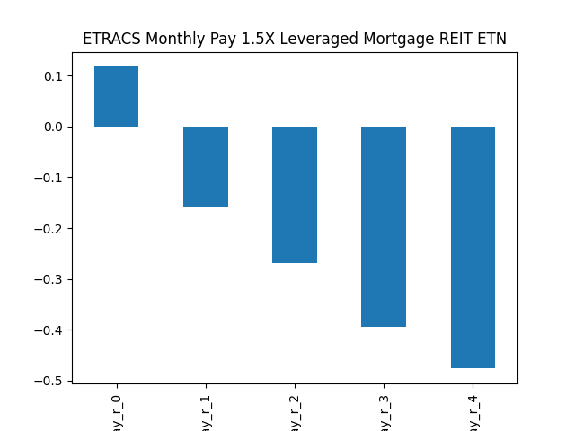

# dividend-shorter

bet on falling prices on payday **2026-02-12**.

## Signale

| Ticker   |   Divid Rate |   Close |   Volume |   last_close_volume |   Divid % | 5_Days_pos   | above_SMA_50   |
|:---------|-------------:|--------:|---------:|--------------------:|----------:|:-------------|:---------------|
| MVRL     |         0.5  |   15.42 |    17900 |              276018 |      3.25 | False        | True           |
| HSNGY    |        19.75 |   19.7  |     8100 |              159570 |    100.25 | True         | True           |

## MVRL

### Erwartung in R
|      |   Day_r_0 |   Day_r_1 |   Day_r_2 |   Day_r_3 |   Day_r_4 |   Treffer |
|:-----|----------:|----------:|----------:|----------:|----------:|----------:|
| ohne |       0.1 |      -0.1 |      -0.1 |      -0.3 |      -0.4 |        67 |
| mit  |      -0.5 |      -0.2 |      -0.5 |      -0.5 |      -1   |         1 |

### Ohne Filter

### Mit Filter

## HSNGY

### Erwartung in R
|      |   Day_r_0 |   Day_r_1 |   Day_r_2 |   Day_r_3 |   Day_r_4 |   Treffer |
|:-----|----------:|----------:|----------:|----------:|----------:|----------:|
| ohne |      -0.1 |      -0   |      -0.1 |      -0.2 |      -0.5 |        79 |
| mit  |      -0   |      -0.1 |      -0.1 |      -0.2 |      -0.2 |         1 |

### Ohne Filter

### Mit Filter

