# dividend-shorter

bet on falling prices on payday **2025-04-25**.

## Signale

| Ticker   |   Divid Rate |   Close |          Volume |   last_close_volume |   Divid % | 5_Days_pos   | above_SMA_50   |
|:---------|-------------:|--------:|----------------:|--------------------:|----------:|:-------------|:---------------|
| SAXPY    |         0.75 |   20.5  |  29200          |              598600 |      3.65 | True         | True           |
| LGGNY    |         0.99 |   16.79 |  56300          |              945277 |      5.92 | True         | True           |
| ING      |         0.77 |   19.69 |      1.8308e+06 |            36048452 |      3.9  | True         | True           |
| ICMB     |         0.12 |    3.12 | 229900          |              717288 |      3.85 | True         | True           |
| ANGPY    |         0.5  |    6.1  |  71200          |              434320 |      8.16 | False        | True           |

## SAXPY

### Erwartung in R
|      |   Day_r_0 |   Day_r_1 |   Day_r_2 |   Day_r_3 |   Day_r_4 |   Treffer |
|:-----|----------:|----------:|----------:|----------:|----------:|----------:|
| ohne |      -0.1 |      -0   |      -0.1 |      -0.2 |         0 |        14 |
| mit  |      -0.4 |      -0.3 |      -0.1 |      -0.5 |         0 |         2 |

### Ohne Filter
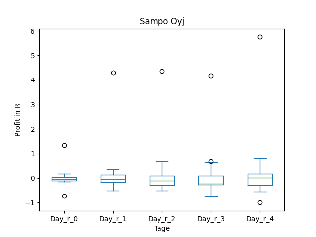
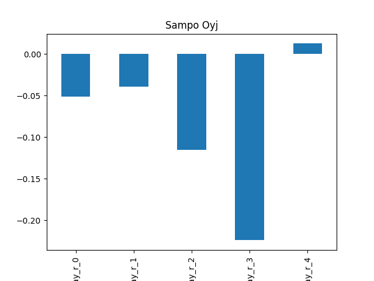

### Mit Filter

## LGGNY

### Erwartung in R
|      |   Day_r_0 |   Day_r_1 |   Day_r_2 |   Day_r_3 |   Day_r_4 |   Treffer |
|:-----|----------:|----------:|----------:|----------:|----------:|----------:|
| ohne |      -0   |       0   |      -0.1 |      -0.1 |      -0.1 |        26 |
| mit  |      -0.1 |      -0.1 |      -0.2 |      -0.1 |      -0.1 |         1 |

### Ohne Filter
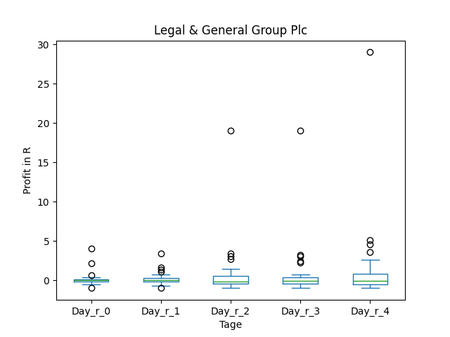
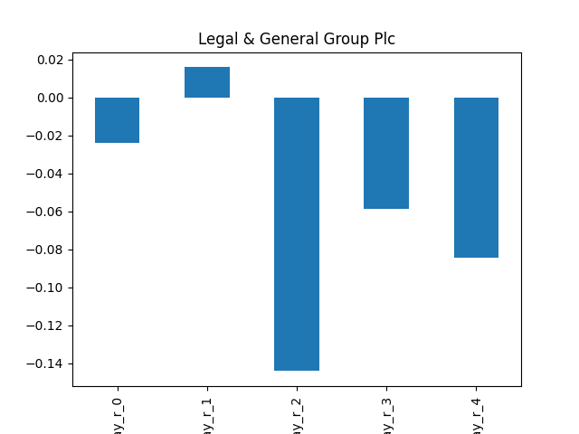

### Mit Filter
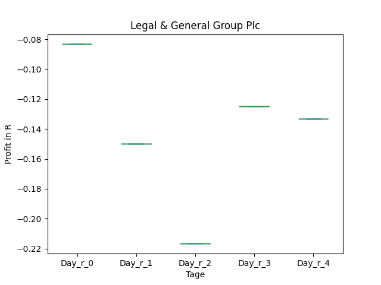
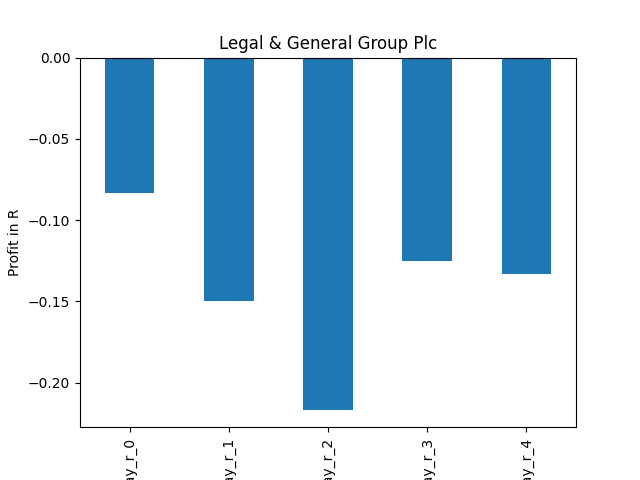

## ING

### Erwartung in R
|      |   Day_r_0 |   Day_r_1 |   Day_r_2 |   Day_r_3 |   Day_r_4 |   Treffer |
|:-----|----------:|----------:|----------:|----------:|----------:|----------:|
| ohne |         0 |      -0   |       0.2 |      -0.1 |       0.1 |        31 |
| mit  |         0 |      -0.1 |      -0.1 |      -0.1 |       0.1 |         9 |

### Ohne Filter
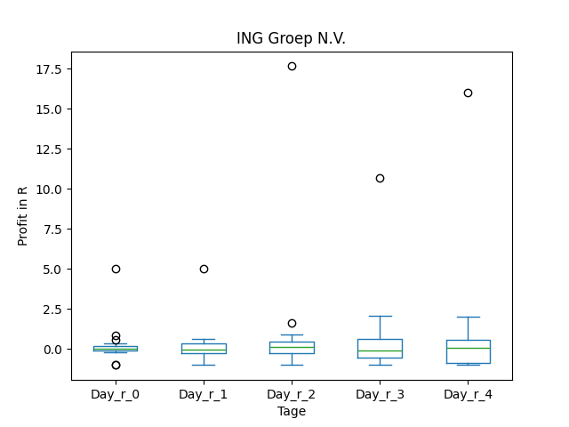
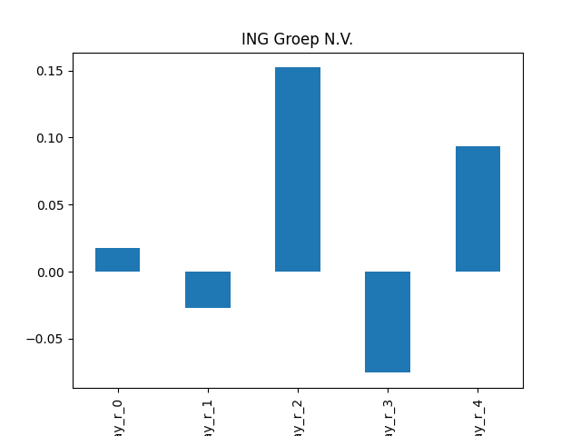

### Mit Filter
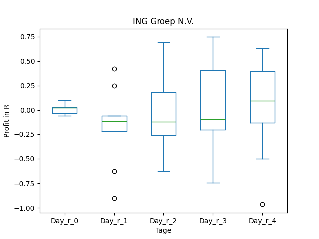
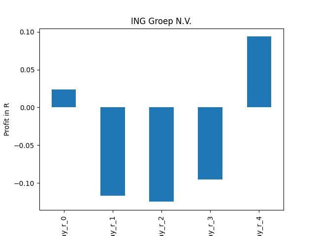

## ICMB

### Erwartung in R
|      |   Day_r_0 |   Day_r_1 |   Day_r_2 |   Day_r_3 |   Day_r_4 |   Treffer |
|:-----|----------:|----------:|----------:|----------:|----------:|----------:|
| ohne |       0.4 |       0.6 |       0.7 |       0.4 |       0.6 |        54 |
| mit  |      -0.1 |      -0   |      -0.1 |      -0.3 |      -0.2 |         1 |

### Ohne Filter
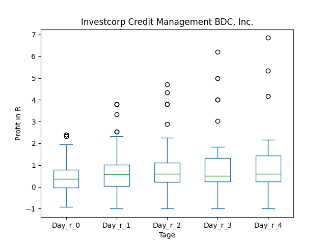

### Mit Filter

## ANGPY

### Erwartung in R
|      |   Day_r_0 |   Day_r_1 |   Day_r_2 |   Day_r_3 |   Day_r_4 |   Treffer |
|:-----|----------:|----------:|----------:|----------:|----------:|----------:|
| ohne |         0 |        -0 |        -0 |      -0.1 |      -0.1 |        30 |
| mit  |       nan |       nan |       nan |     nan   |     nan   |         0 |

### Ohne Filter

### Mit Filter

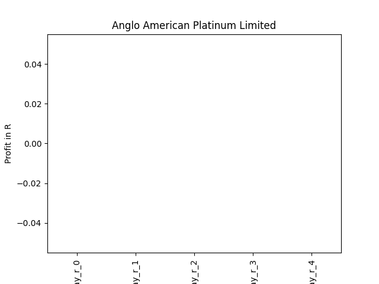

