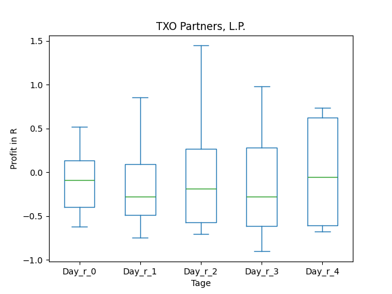
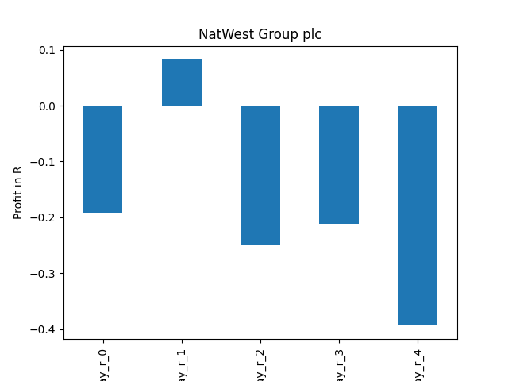
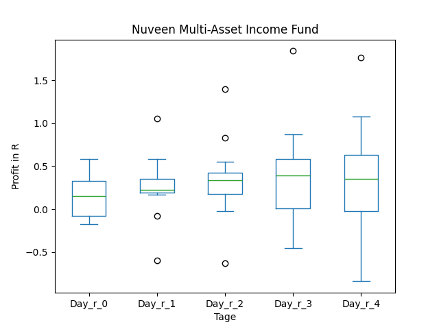
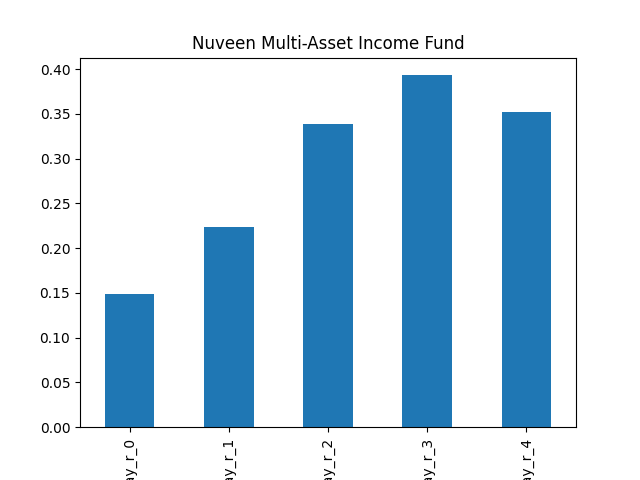
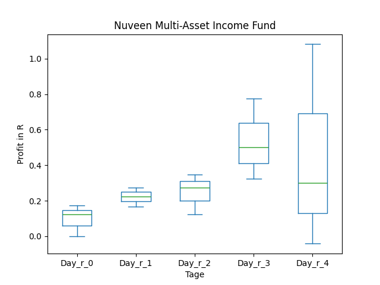

# dividend-shorter

bet on falling prices on payday **2025-03-14**.

## Signale

| Ticker   |   Divid Rate |   Close |          Volume |   last_close_volume |   Divid % | 5_Days_pos   | above_SMA_50   |
|:---------|-------------:|--------:|----------------:|--------------------:|----------:|:-------------|:---------------|
| WHGLY    |         0.46 |   17.62 | 476800          |             8401216 |      2.63 | True         | True           |
| TXO      |         0.61 |   19.61 | 111600          |             2188476 |      3.11 | True         | True           |
| NWG      |         0.39 |   11.68 |      4.8324e+06 |            56442432 |      3.34 | False        | True           |
| NREF     |         0.5  |   16.13 |  66600          |             1074258 |      3.1  | False        | True           |
| NMAI     |         0.42 |   12.29 | 207000          |             2544030 |      3.4  | False        | False          |
| MRCC     |         0.25 |    8.06 |  82800          |              667368 |      3.1  | False        | False          |
| EDVMF    |         0.57 |   22.19 | 269900          |             5989081 |      2.57 | True         | True           |
| CSWC     |         0.58 |   21.79 |      1.123e+06  |            24470170 |      2.66 | False        | False          |

## WHGLY

### Erwartung in R
|      |   Day_r_0 |   Day_r_1 |   Day_r_2 |   Day_r_3 |   Day_r_4 |   Treffer |
|:-----|----------:|----------:|----------:|----------:|----------:|----------:|
| ohne |       0.2 |      -0.2 |      -0.4 |      -0.8 |      -0.6 |        19 |
| mit  |       0.1 |      -0.4 |      -0.5 |      -0.8 |      -0.6 |         1 |

### Ohne Filter

### Mit Filter

## TXO

### Erwartung in R
|      |   Day_r_0 |   Day_r_1 |   Day_r_2 |   Day_r_3 |   Day_r_4 |   Treffer |
|:-----|----------:|----------:|----------:|----------:|----------:|----------:|
| ohne |      -0.1 |      -0.3 |      -0.2 |      -0.3 |      -0.1 |         7 |
| mit  |      -0.3 |      -0.5 |      -0.2 |       0   |       0.7 |         1 |

### Ohne Filter

### Mit Filter

## NWG

### Erwartung in R
|      |   Day_r_0 |   Day_r_1 |   Day_r_2 |   Day_r_3 |   Day_r_4 |   Treffer |
|:-----|----------:|----------:|----------:|----------:|----------:|----------:|
| ohne |      -0   |       0   |      -0   |      -0.1 |      -0.3 |        15 |
| mit  |      -0.2 |       0.1 |      -0.3 |      -0.2 |      -0.4 |         5 |

### Ohne Filter

### Mit Filter

## NREF

### Erwartung in R
|      |   Day_r_0 |   Day_r_1 |   Day_r_2 |   Day_r_3 |   Day_r_4 |   Treffer |
|:-----|----------:|----------:|----------:|----------:|----------:|----------:|
| ohne |       0.2 |       0.5 |       0.6 |       0.5 |       1   |        24 |
| mit  |       0.1 |       0.3 |       0.5 |       0.2 |       0.1 |         4 |

### Ohne Filter

### Mit Filter

## NMAI

### Erwartung in R
|      |   Day_r_0 |   Day_r_1 |   Day_r_2 |   Day_r_3 |   Day_r_4 |   Treffer |
|:-----|----------:|----------:|----------:|----------:|----------:|----------:|
| ohne |       0.1 |       0.2 |       0.3 |       0.4 |       0.4 |        14 |
| mit  |       0.1 |       0.2 |       0.3 |       0.5 |       0.3 |         3 |

### Ohne Filter

### Mit Filter

## MRCC

### Erwartung in R
|      |   Day_r_0 |   Day_r_1 |   Day_r_2 |   Day_r_3 |   Day_r_4 |   Treffer |
|:-----|----------:|----------:|----------:|----------:|----------:|----------:|
| ohne |       0.1 |       0.3 |       0.3 |       0.3 |       0.5 |        49 |
| mit  |       0.3 |       1.4 |       1.1 |       1.3 |       1.6 |         7 |

### Ohne Filter

### Mit Filter

## EDVMF

### Erwartung in R
|      |   Day_r_0 |   Day_r_1 |   Day_r_2 |   Day_r_3 |   Day_r_4 |   Treffer |
|:-----|----------:|----------:|----------:|----------:|----------:|----------:|
| ohne |       0.2 |      -0.2 |      -0.2 |      -0.3 |        -1 |         7 |
| mit  |     nan   |     nan   |     nan   |     nan   |       nan |         0 |

### Ohne Filter

### Mit Filter

## CSWC

### Erwartung in R
|      |   Day_r_0 |   Day_r_1 |   Day_r_2 |   Day_r_3 |   Day_r_4 |   Treffer |
|:-----|----------:|----------:|----------:|----------:|----------:|----------:|
| ohne |       0.1 |       0.2 |       0.2 |       0.1 |       0.2 |        90 |
| mit  |      -0.1 |       0.6 |       0.1 |       0.4 |      -0   |         7 |

### Ohne Filter

### Mit Filter

