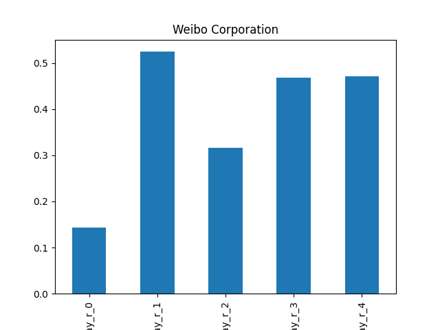
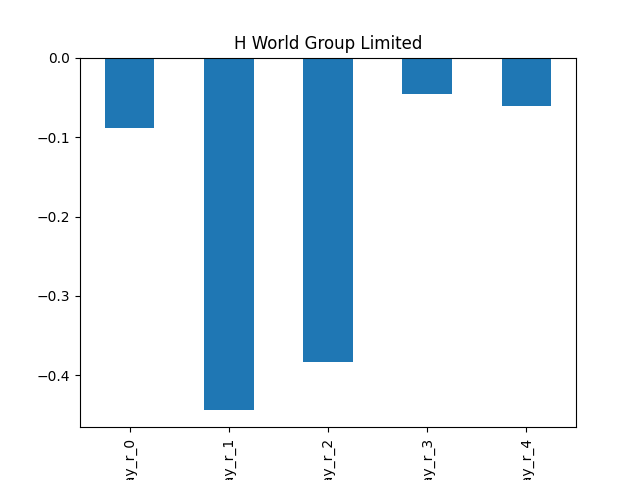

# dividend-shorter

bet on falling prices on payday **2025-04-09**.

## Signale

| Ticker   |   Divid Rate |   Close |         Volume |   last_close_volume |   Divid % | 5_Days_pos   | above_SMA_50   |
|:---------|-------------:|--------:|---------------:|--------------------:|----------:|:-------------|:---------------|
| WB       |         0.82 |    7.85 |     5.0546e+06 |            39678610 |     10.45 | False        | False          |
| SKBSY    |         0.79 |   20.2  | 39000          |              787800 |      3.91 | False        | False          |
| HTHT     |         0.97 |   30.82 |     2.7255e+06 |            83999910 |      3.15 | False        | False          |
| BBVA     |         0.44 |   11.9  |     2.8809e+06 |            34282710 |      3.73 | False        | False          |

## WB

### Erwartung in R
|      |   Day_r_0 |   Day_r_1 |   Day_r_2 |   Day_r_3 |   Day_r_4 |   Treffer |
|:-----|----------:|----------:|----------:|----------:|----------:|----------:|
| ohne |       0.1 |       0.5 |       0.3 |       0.5 |       0.5 |         2 |
| mit  |       0.1 |       0.5 |       0.3 |       0.5 |       0.5 |         2 |

### Ohne Filter

### Mit Filter

## SKBSY

### Erwartung in R
|      |   Day_r_0 |   Day_r_1 |   Day_r_2 |   Day_r_3 |   Day_r_4 |   Treffer |
|:-----|----------:|----------:|----------:|----------:|----------:|----------:|
| ohne |         0 |        -0 |      -0.2 |      -0.7 |        -0 |        13 |
| mit  |       nan |       nan |     nan   |     nan   |       nan |         0 |

### Ohne Filter

### Mit Filter

## HTHT

### Erwartung in R
|      |   Day_r_0 |   Day_r_1 |   Day_r_2 |   Day_r_3 |   Day_r_4 |   Treffer |
|:-----|----------:|----------:|----------:|----------:|----------:|----------:|
| ohne |      -0.1 |      -0.4 |      -0.4 |      -0   |      -0.1 |         8 |
| mit  |      -0.3 |       0.1 |       1.6 |       1.6 |       3.2 |         1 |

### Ohne Filter

### Mit Filter

## BBVA

### Erwartung in R
|      |   Day_r_0 |   Day_r_1 |   Day_r_2 |   Day_r_3 |   Day_r_4 |   Treffer |
|:-----|----------:|----------:|----------:|----------:|----------:|----------:|
| ohne |       0   |       0.2 |       0.1 |      -0.1 |      -0.1 |        65 |
| mit  |      -0.1 |      -0.1 |      -0.1 |      -0.2 |      -0.5 |         6 |

### Ohne Filter

### Mit Filter

